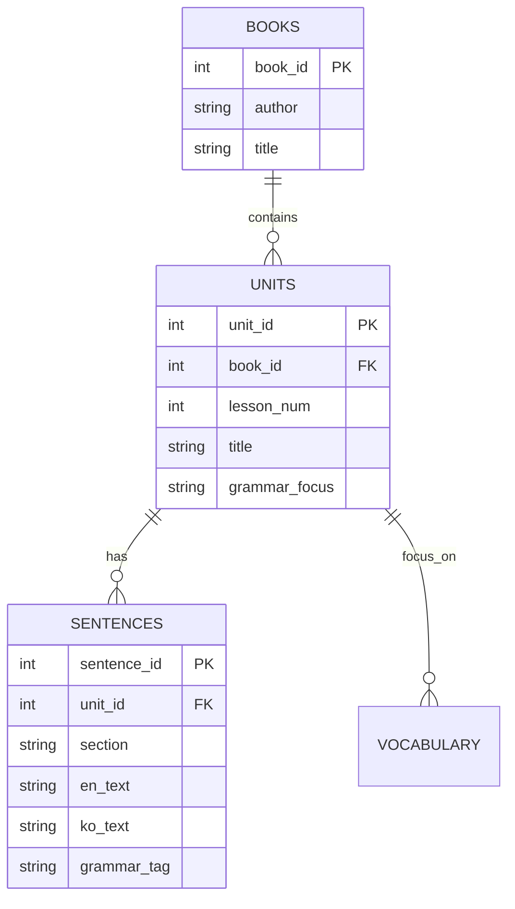

# [ERD] 중학 영어 3 교과서 통합 데이터베이스 설계 (이재영 & 정사열)

본 문서는 이재영, 정사열 저자의 중학 3학년 영어 교과서 데이터를 웹 서비스에서 활용하기 위한 관계형 데이터베이스(RDB) 설계도입니다.

## 1. 개요
각 저자별로 상이한 데이터 형식을 표준화하여 **단원(Unit) 기반**으로 분류하고, 구문 분석 및 학습 서비스에 즉시 투입 가능한 구조로 설계하였습니다.

## 2. 테이블 스키마 정의 (ERD Specs)

### 2-1. `books` (교과서 마스터)
| 칼럼명 | 타입 | 제약조건 | 설명 |
| :--- | :--- | :--- | :--- |
| `book_id` | INT | PK, AI | 교과서 식별자 |
| `author` | VARCHAR | NOT NULL | 저자명 (이재영, 정사열) |
| `title` | VARCHAR | NOT NULL | 교과서 제목 |
| `curriculum` | VARCHAR | | 교육과정 버전 (예: 2015 개정) |

### 2-2. `units` (단원 정보)
| 칼럼명 | 타입 | 제약조건 | 설명 |
| :--- | :--- | :--- | :--- |
| `unit_id` | INT | PK, AI | 단원 식별자 |
| `book_id` | INT | FK (books) | 소속 교과서 |
| `lesson_num` | INT | | 단원 번호 (1~8) |
| `title` | VARCHAR | | 단원 소제목 |
| `topic` | TEXT | | 주요 학습 주제 |
| `grammar_focus`| TEXT | | 핵심 문법 항목 |
| `page_start` | INT | | 시작 페이지 |
| `page_end` | INT | | 종료 페이지 |

### 2-3. `sentences` (학습 문장 데이터)
| 칼럼명 | 타입 | 제약조건 | 설명 |
| :--- | :--- | :--- | :--- |
| `sentence_id` | INT | PK, AI | 문장 식별자 |
| `unit_id` | INT | FK (units) | 소속 단원 |
| `section` | VARCHAR | | 파트명 (Listening, Reading, Grammar) |
| `en_text` | TEXT | NOT NULL | 영어 원문 |
| `ko_text` | TEXT | | 한글 해석 |
| `grammar_tag` | VARCHAR | | 특정 문법 포인트 |
| `page_num` | INT | | 교과서 페이지 |

---

## 3. 테이블 관계도 (Mermaid)

---
> [!TIP]
> 위 구조는 **RAG(Retrieval-Augmented Generation)** 시스템 구축 시 검색 단위(Chunk)를 단원별, 문법별로 정교화하는 데 최적화되어 있습니다.
