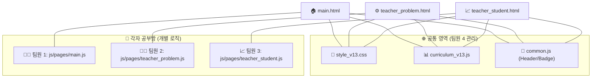

# 🏛️ 프로젝트 마스터 가이드: 4인 협업 빌리지
**일시**: 2026-04-07 09:35:12 | **상태**: 🚀 개발 준비 완료

팀원 여러분, 우리 '문장투시경 v13'이 4인 협업에 최적화된 **멀티 페이지 아키텍처**로 재탄생했습니다. 이제 각자 담당한 영역에서 최고의 퍼포먼스를 보여주세요!

---

## 🗺️ 1. 프로젝트 아키텍처 맵
우리 앱이 어떤 구조로 연결되어 있는지 한눈에 확인하세요.

---

## 📋 2. 팀원별 R&R (역할과 책임)
*본인의 전용 파일만 수정하면 Git 충돌(Conflict)이 절대 발생하지 않습니다.*

| 담당자 | 주요 역할 | 전용 로직 파일 (수정 영역) | 연동 HTML |
| :--- | :--- | :--- | :--- |
| **🧑‍🎓 팀원 1** | **학생 훈련 및 단원 선택** | `js/pages/main.js` | `main.html` |
| **🧑‍🏫 팀원 2** | **교사용 문제 세부 설정** | `js/pages/teacher_problem.js` | `teacher_problem.html` |
| **📈 팀원 3** | **학생 학습 결과 통계** | `js/pages/teacher_student.js` | `teacher_student.html` |
| **🎨 팀원 4** | **전체 디자인 및 공통 UI** | `css/style_v13.css`, `common.js` | (전체 공통) |

---

## 💡 3. 바이브 코딩 실전 가이드

> [!TIP]
> **"난 내 파일만 본다!"**
> AI와 대화할 때 "이 프로젝트의 `js/pages/main.js` 파일을 수정해줘"라고 명확히 지시하세요. HTML은 이제 껍데기일 뿐입니다!

> [!IMPORTANT]
> **"공통 영역 수정은 팀원 4에게!"**
> 헤더의 색깔을 바꾸고 싶거나 새로운 공용 버튼이 필요하면 `common.js` 담당자인 팀원 4와 상의하세요.

> [!CAUTION]
> **"데이터 구조는 건드리지 마세요!"**
> `curriculum_v13.js`의 형식을 바꾸면 모든 팀원의 페이지가 멈출 수 있으니 주의해 주세요.

---

### 🏁 다음 단계
1. **팀원 소집**: 이 가이드를 팀원들과 공유하세요.
2. **개별 개발**: 각자 본인의 JS 로직 파일을 열고 기능을 붙여나갑니다.
3. **통합 테스트**: 모든 기능이 붙으면 팀장님 주관 하에 전체 흐름을 점검합니다.

**팀장님의 리더십 아래, 멋진 프로젝트를 완성해 봅시다! 🏆🚀**
