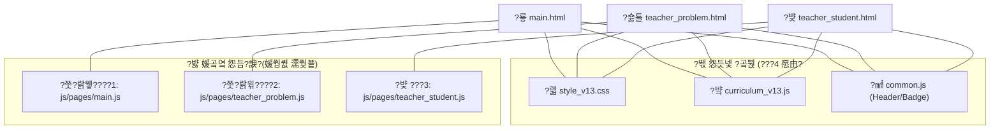

# ?꾨줈?앺듃 吏꾨떒 寃곌낵: 媛?HTML ?뚯씪??由ъ냼??怨듭쑀 ?꾪솴 鍮꾧탳

?덈뀞?섏꽭?? ?€???щ윭遺? ?꾩옱 吏꾪뻾 以묒씤 3媛쒖쓽 二쇱슂 HTML ?뚯씪(`index.html`, `index-teacher.html`, `index-min.html`)???€?댁꽌 媛??뚯씪???대뼡 ?먯썝(由ъ냼??諛??꾨줈洹몃옩)???ъ슜?섍퀬 ?덈뒗吏€ 遺꾩꽍??蹂댁븯?듬땲??

?곕━媛€ 媛쒕컻 以묒씤 ?꾨줈洹몃옩??援ъ“瑜????쎄쾶 ?댄빐?????덈룄濡? ???뚯씪??怨듯넻?쇰줈 ?ъ슜?섎뒗 由ъ냼?ㅼ? 媛??뚯씪留뚯씠 蹂꾨룄濡??ъ슜?섎뒗 ?⑤룆 由ъ냼?ㅻ? ?뺣━?덉뒿?덈떎.

---

## 1. ???뚯씪??紐⑤몢 怨듭쑀?섍퀬 ?덈뒗 由ъ냼??(怨듯넻 遺€遺?
???꾨줈洹몃옩 紐⑤몢 湲곕낯?곸씤 ?붿옄?멸낵 ?듭떖 湲곕뒫??援ъ꽦?섍린 ?꾪빐 ?꾨옒???몃? ?쇱씠釉뚮윭由ъ? 濡쒖뺄 ?곗씠?곕뱾????媛숈씠 怨듭쑀?섏뿬 ?ъ슜?섍퀬 ?덉뒿?덈떎.

* **?몃? ?쇱씠釉뚮윭由??묒옱 (CDN 諛⑹떇)**
  * **?고듃**: 援ш? ?고듃 `Noto Sans KR` (?꾩껜?곸씤 湲€瑗??붿옄???듭씪)
  * **React ?붿쭊**: `react.development.js`, `react-dom.development.js` (?붾㈃??洹몃━湲??꾪븳 ?듭떖 ?꾨젅?꾩썙??
  * **Babel 而댄뙆?쇰윭**: `babel.min.js` (由ъ븸?몄쓽 JSX 臾몃쾿??釉뚮씪?곗?媛€ ?쎌쓣 ???덈룄濡?蹂€??
  * **Chart.js**: `chart.js` (?듦퀎??李⑦듃瑜?洹몃┫ ???ъ슜)
* **?대? 濡쒖뺄 ?뚯씪 (怨듯넻 ?곌껐)**
  * **?붿옄???뚯씪 (CSS)**: `css/style_v13.css` (??踰꾩쟾 紐⑤몢 ?숈씪???ㅽ??쇨낵 ?붿옄??洹쒖튃??怨듭쑀)
  * **?곗씠???뚯씪 (JS)**: `js/curriculum_v13.js` (?⑥썝, 臾몄옣 ???숈뒿怨?愿€?⑤맂 怨듯넻 而ㅻ━?섎읆 ?곗씠??

---

## 2. 媛??뚯씪??怨듭쑀?섏? ?딄퀬 ?⑤룆?쇰줈 ?ъ슜?섎뒗 蹂꾨룄 由ъ냼??(媛쒕퀎 遺€遺?
?꾨줈洹몃옩???몃? ???뺥깭(?쇰컲 ?숈깮??而댄룷?뚰듃, ?좎깮?섏슜 而댄룷?뚰듃, ?뱀? ?듯빀??而댄룷?뚰듃)???곕씪???붾㈃???쒖뼱?섎뒗 ?듭떖 濡쒖쭅(?붿쭊) 肄붾뱶???쒕줈 怨듭쑀?섏? ?딄퀬 媛곸옄 ?ㅻⅨ 諛⑹떇??梨꾪깮?섍퀬 ?덉뒿?덈떎.

* **?뱞 `index.html` (?숈깮???쇰컲 硫붿씤 踰꾩쟾)**
  * **怨좎쑀 ?곌껐 由ъ냼??*: `js/app_v13.js`
  * **?ㅻ챸**: 硫붿씤 ?좏뵆由ъ??댁뀡 ?붿쭊 濡쒖쭅???몃? 遺꾨━ ?뚯씪濡?愿€由щ릺硫? ?대? 遺덈윭?€???꾩껜 ?깆쓣 ?숈옉?쒗궢?덈떎.

* **?뱞 `index-teacher.html` (援먯궗??愿€由ъ옄 踰꾩쟾)**
  * **怨좎쑀 ?곌껐 由ъ냼??*: `js/teacher_admin_v13.js`
  * **?ㅻ챸**: 援먯궗??愿€由ъ옄 ?붿쭊??蹂꾨룄濡??먯뼱, ?좎깮?섎뱾?먭쾶 ?꾩슂???숆툒 遺꾩꽍, ?⑥썝 諛고룷 ?깆쓽 ?명꽣?섏씠?ㅻ쭔???ㅻ（???꾩슜 濡쒖쭅 ?뚯씪???곌껐?섏뼱 ?덉뒿?덈떎.

* **?뱞 `index-min.html` (?듯빀 ?⑥씪 踰꾩쟾)**
  * **怨좎쑀 由ъ냼??(?몃씪???쎌엯)**: ?몃???.js ?뚯씪濡?濡쒖쭅??鍮쇱? ?딄퀬, HTML ?대???`<script type="text/babel">` ?쒓렇 ?덉뿉 **濡쒖쭅(App 而댄룷?뚰듃 諛??숈옉 肄붾뱶) ?꾩껜媛€ 吏곸젒 肄붾뵫**?섏뼱 ?덉뒿?덈떎.
  * **?ㅻ챸**: ?뚯씪 ?섎굹濡??꾨줈洹몃옩???낅┰?곸쑝濡??꾩슱 ???덈룄濡?湲고쉷??踰꾩쟾?대씪, 蹂꾨룄??濡쒖뺄 ?몃? ?ㅽ겕由쏀듃 ?붿쭊 ?뚯씪???곌껐?섏? ?딆뒿?덈떎.

---

??由ы룷?멸? ?꾩껜 ?꾨줈?앺듃??援ъ“瑜??댄빐?섍퀬 ?묒뾽?섎뒗 ?????꾩????섍만 諛붾엻?덈떎. 異붽?濡?沅곴툑??遺€遺꾩씠 ?덈떎硫??몄젣?좎? ?€?먭쾶 ?섍린??二쇱꽭?? ??
# ?룛截?由ъ냼??援ъ“??諛??묒뾽 理쒖쟻??吏€移⑥꽌
**?앹꽦 ?쇱떆**: 2026-04-07 09:18:13

?€?λ떂??吏€?쒖뿉 ?곕씪 4???묒뾽 ?⑥쑉??洹밸??뷀븯湲??꾪빐 由ъ냼?ㅻ? ?ㅼ쓬怨?媛숈씠 怨듯넻怨?媛쒕퀎濡?援щ텇?섏뿬 愿€由ы빀?덈떎.

## 1. ?뙋 怨듯넻 由ъ냼??(Common Resources)
*紐⑤뱺 ?섏씠吏€?먯꽌 怨듭쑀?섎ʼn, 二쇰줈 UI/UX ?대떦???€??4)媛€ 愿€由ы빀?덈떎.*

| 援щ텇 | ?뚯씪 寃쎈줈 | ?대떦 諛???븷 |
| :--- | :--- | :--- |
| **?ㅽ???* | `css/style_v13.css` | ?꾩껜 ?붿옄???ㅼ븻留ㅻ꼫, ?덉씠?꾩썐 愿€由?|
| **?곗씠??* | `js/curriculum_v13.js` | 16媛??⑥썝 ?꾩껜 臾몄옣 諛??듭떖 臾몃쾿 ?곗씠??|
| **UI 而댄룷?뚰듃** | `js/components/common.js` | ?곷떒 諛?Header), 諛곗?(Badge) ??怨듯넻 ?붿냼 |
| **?쇱씠釉뚮윭由?* | React, ReactDOM, Babel | ?몃? CDN 濡쒕뱶 (v18 諛?Standalone) |

---

## 2. ?뱚 媛쒕퀎 ?섏씠吏€ 由ъ냼??(Individual Resources)
*媛??€?먯씠 ?낅┰?곸쑝濡?湲곕뒫??媛쒕컻?섍퀬 ?섏젙?섎뒗 ?곸뿭?낅땲??*

### ?쭛?랅윃?[?€??1] 硫붿씤 ?덈젴 諛??⑥썝 ?좏깮
- **?대떦 ?뚯씪**: `main.html` (諛?異뷀썑 遺꾨━??`js/pages/main.js`)
- **??븷**: ?숈깮???ъ떆寃??덈젴 ??怨쇱젙 諛?援먯궗???⑥썝 ?쒖꽦??濡쒖쭅 愿€由?
### ?쭛?랅윆?[?€??2] 臾몄젣 ?ㅼ젙 諛?愿€由?- **?대떦 ?뚯씪**: `teacher_problem.html` (諛?`js/pages/teacher_problem.js`)
- **??븷**: 援먯궗??臾몄젣 ?몃? ?€???щ같?? 鍮덉뭏 ?? ?ㅼ젙 ?붾㈃ 諛??곗씠???€??愿€由?
### ?뱤 [?€??3] ?숈깮 愿€由?諛?寃곌낵 ?듦퀎
- **?대떦 ?뚯씪**: `teacher_student.html` (諛?`js/pages/teacher_student.js`)
- **??븷**: ?숆툒 ?꾩껜 吏꾪뻾瑜? 媛쒕퀎 ?숈깮 ?ㅻ떟 ?꾪솴 諛??듦퀎 ?곗씠???쒓컖??
---

## 3. ?? ?묒뾽???꾪븳 Golden Rules (Git 異⑸룎 諛⑹?)
1. **???곸뿭留?嫄대뱶由ш린**: ?닿? ?대떦??HTML/JS ?뚯씪 ?몄쓽 ?ㅻⅨ ?뚯씪?€ 媛€湲됱쟻 ?댁? ?딆뒿?덈떎.
2. **怨듯넻 而댄룷?뚰듃 ?섏젙 ??*: Header??Badge ?붿옄??蹂€寃쎌씠 ?꾩슂?섎㈃ 諛섎뱶???€??4(UI/UX)?먭쾶 ?붿껌?섍굅???곸쓽 ??`common.js`瑜??섏젙?⑸땲??
3. **?곗씠??援ъ“ 蹂€寃?湲덉?**: `curriculum_v13.js`???곗씠??援ъ“瑜??꾩쓽濡?諛붽씀硫?紐⑤뱺 ?€?먯쓽 ?섏씠吏€媛€ 源⑥쭏 ???덉쑝???€?λ떂 ?뱀씤 ?섏뿉 吏꾪뻾?⑸땲??

> [!IMPORTANT]
> ?댁젣 媛곸옄 留≪쑝???뚯씪?먯꽌 ?쒖썝?섍쾶 媛쒕컻???쒖옉??二쇱떗?쒖삤! 
# ?뢾 由ъ냼??遺꾨━ 諛??묒뾽 ?섍꼍 援ъ텞 ?꾨즺 蹂닿퀬??
**?묒꽦 ?쇱떆**: 2026-04-07 09:30:15
**?묒뾽??*: Antigravity (?€??蹂댁쥖 AI)

?€?λ떂, 4???€ ?묒뾽???꾪븳 '諛붿씠釉?肄붾뵫' 理쒖쟻???섍꼍 援ъ텞??紐⑤몢 ?꾨즺?섏뿀?듬땲??

## 1. ?뱛 理쒖쥌 ?꾨줈?앺듃 援ъ“??
```text
g-ray-hrkang/
?쒋??€ index.html            (?뵎 濡쒓렇???낃뎄)
?쒋??€ main.html             (?룧 硫붿씤 ?덈젴/?⑥썝 愿€由?
?쒋??€ teacher_problem.html  (?숋툘 臾몄젣 ?ㅼ젙 ?쒕퉬??
?쒋??€ teacher_student.html  (?뱤 ?숈깮 寃곌낵 ?쒕퉬??
?쒋??€ css/
??  ?붴??€ style_v13.css     (?렓 怨듯넻 ?붿옄??- ?€??4)
?붴??€ js/
    ?쒋??€ curriculum_v13.js (?뱤 怨듯넻 ?곗씠??
    ?쒋??€ components/
    ??  ?붴??€ common.js     (?㎟ 怨듭슜 而댄룷?뚰듃 - ?€??4)
    ?붴??€ pages/            (?쭬 ?섏씠吏€蹂??먮뇤 - ?€??1, 2, 3)
        ?쒋??€ main.js            (?쭛?랅윃??숈깮 ?덈젴 濡쒖쭅)
        ?쒋??€ teacher_problem.js (?쭛?랅윆?臾몄젣 ?몃? ?ㅼ젙)
        ?붴??€ teacher_student.js (?뱤 寃곌낵 ?듦퀎 酉곗뼱)
```

## 2. ?썱截??묒뾽 ?곸꽭 寃곌낵

### ??[main.html] 濡쒖쭅 遺꾨━
- 400??以꾩쓽 ?덈젴 濡쒖쭅??`js/pages/main.js`濡?異붿텧
- ?댁쫰 3?④퀎(?щ같?? 鍮덉뭏, ?곸옉) 諛??€?쒕낫??濡쒖쭅 ?ы븿

### ??[teacher_problem.html] 濡쒖쭅 遺꾨━
- 200??以꾩쓽 臾몄젣 ?ㅼ젙 濡쒖쭅??`js/pages/teacher_problem.js`濡?異붿텧
- ?⑥썝蹂??쒖꽦??諛??덈Ц ?€???ㅼ젙 湲곕뒫

### ??[teacher_student.html] 濡쒖쭅 遺꾨━
- 100??以꾩쓽 寃곌낵 ?듦퀎 濡쒖쭅??`js/pages/teacher_student.js`濡?異붿텧
- ?숈깮蹂?吏꾩쿃??諛?諛곗? ?쒖뒪???곕룞

## 3. ?뮕 ?€???€???뚯쭛 媛€?대뱶 (?€?λ떂 ?꾨떖??
> "?щ윭遺? ?댁젣 HTML ?뚯씪??嫄대뱶由??꾩슂媛€ ?놁뒿?덈떎. 媛곸옄 留≪? **`js/pages/`** ?대뜑 ?덉쓽 ?뚯씪留??섏젙?섏꽭?? ?뱀떆???ㅻ뜑 ?붿옄?몄씠 留섏뿉 ???ㅻ㈃ **`js/components/common.js`**瑜??대떦?섎뒗 ?€??4?먭쾶 ?뺤쨷???붿껌?섏떆湲?諛붾엻?덈떎!"

---
**?€?λ떂! ?댁젣 4紐낆쓽 珥덈낫 ?꾨줈洹몃옒癒몃뱾??異⑸룎 ?놁씠 留덉쓬猿?湲곕웾???쇱튌 ???덇쾶 ?섏뿀?듬땲?? ???꾩슂?섏떊 紐낅졊???덉쑝?쒕㈃ ?몄젣??留먯???二쇱꽭??** ?ァ??
# ?뱛 理쒖쥌 ?꾨줈?앺듃 ?뚯씪 援ъ꽦 諛???븷 遺꾨떞??**?앹꽦 ?쇱떆**: 2026-04-07 09:33:24

?€???щ윭遺? ?곕━ '臾몄옣?ъ떆寃?v13' ?꾨줈?앺듃??理쒖쥌 吏€?꾩엯?덈떎. 蹂몄씤???대떦 ?곸뿭???뺤씤?섍퀬, ?ㅻⅨ ?щ엺???곸뿭怨?寃뱀퀜??異⑸룎???섏? ?딅룄濡?二쇱쓽??二쇱꽭??

---

## ?룛截?1. 怨듯넻 由ъ냼???곸뿭 (Common Area)
*紐⑤뱺 ?섏씠吏€媛€ ?④퍡 ?ъ슜?섎뒗 '怨듦났 ?쒖꽕'?낅땲?? ?€??4(?붿옄??媛€ 二쇰줈 愿€由ы빀?덈떎.*

| ?뚯씪 寃쎈줈 | ?뚯씪 ?깃꺽 | 鍮꾧퀬 |
| :--- | :--- | :--- |
| `index.html` | 濡쒓렇??諛??낃뎄 | ?€??怨듯넻 愿€由?|
| `css/style_v13.css` | ?렓 ?꾩껜 ?붿옄???ㅽ???| ?€??4 (UI/UX) ?꾨Ц ?곸뿭 |
| `js/components/common.js` | ?㎟ 怨듯넻 UI 而댄룷?뚰듃 | Header, Badge ??怨듭쑀 遺€??|
| `js/curriculum_v13.js` | ?뱤 而ㅻ━?섎읆 DB | 16媛??⑥썝 ?꾩껜 ?곸뼱 ?곗씠??|

---

## ?뱚 2. ?€?먮퀎 媛쒕퀎 ?곸뿭 (Individual Area)
*媛??€?먯쓽 '?꾩슜 ?곌뎄???낅땲?? 蹂몄씤 ?대떦 ?뚯씪留?留덉쓬猿??섏젙?섏꽭??*

### ?쭛?랅윃?[?€??1] ?ъ떆寃??덈젴 & ?⑥썝 愿€由?- **?듭떖 濡쒖쭅**: `js/pages/main.js` (?쭬 ???뚯씪??二쇰줈 ?섏젙?섏꽭??
- **猿띾뜲湲?UI**: `main.html`

### ?쭛?랅윆?[?€??2] 援먯궗??臾몄젣 ?ㅼ젙 ?쇳꽣
- **?듭떖 濡쒖쭅**: `js/pages/teacher_problem.js` (?쭬 ???뚯씪??二쇰줈 ?섏젙?섏꽭??
- **猿띾뜲湲?UI**: `teacher_problem.html`

### ?뱢 [?€??3] ?숈깮 愿€由?諛?寃곌낵 ?듦퀎
- **?듭떖 濡쒖쭅**: `js/pages/teacher_student.js` (?쭬 ???뚯씪??二쇰줈 ?섏젙?섏꽭??
- **猿띾뜲湲?UI**: `teacher_student.html`

---

## ?슗 ?묒뾽???꾪븳 留덉?留??쎌냽
1. **?먮컮?ㅽ겕由쏀듃(`js/pages/`) ?꾩＜ ?묒뾽**: HTML ?뚯씪?€ 援ъ“留??닿퀬 ?덉쑝??媛€湲됱쟻 嫄대뱶由ъ? 留먭퀬, 蹂몄씤 ?대떦 JS ?뚯씪?먯꽌 紐⑤뱺 湲곕뒫??援ы쁽?섏꽭??
2. **怨듯넻 ?ㅽ??쇱? ?붿껌?섍린**: ?꾩껜?곸씤 ?됯컧?대굹 ?고듃 ?섏젙???꾩슂?섎㈃ ?€??4?먭쾶 ?뺤쨷???붿껌?섏뿬 `style_v13.css`瑜??낅뜲?댄듃?섏꽭??
3. **諛붿씠釉?肄붾뵫???듭떖**: ?닿? 留≪? JS ?뚯씪 ?덉뿉??AI?€ ?€?뷀븯硫?留덉쓬猿?湲곕뒫???뺤옣?섏꽭??

> [!TIP]
> ?댁젣 媛곸옄 留≪? JS ?꾩슜 ?뚯씪???닿퀬 肄붾뵫???쒖옉??二쇱꽭?? ?곕━ ?€???깃났?곸씤 媛쒕컻???묒썝?⑸땲?? ?룇??
# ?룢截??꾨줈?앺듃 留덉뒪??媛€?대뱶: 4???묒뾽 鍮뚮━吏€
**?쇱떆**: 2026-04-07 09:35:12 | **?곹깭**: ?? 媛쒕컻 以€鍮??꾨즺

?€???щ윭遺? ?곕━ '臾몄옣?ъ떆寃?v13'??4???묒뾽??理쒖쟻?붾맂 **硫€???섏씠吏€ ?꾪궎?띿쿂**濡??ы깂?앺뻽?듬땲?? ?댁젣 媛곸옄 ?대떦???곸뿭?먯꽌 理쒓퀬???쇳룷癒쇱뒪瑜?蹂댁뿬二쇱꽭??

---

## ?뿺截?1. ?꾨줈?앺듃 ?꾪궎?띿쿂 留??곕━ ?깆씠 ?대뼡 援ъ“濡??곌껐?섏뼱 ?덈뒗吏€ ?쒕늿???뺤씤?섏꽭??



---

## ?뱥 2. ?€?먮퀎 R&R (??븷怨?梨낆엫)
*蹂몄씤???꾩슜 ?뚯씪留??섏젙?섎㈃ Git 異⑸룎(Conflict)???덈? 諛쒖깮?섏? ?딆뒿?덈떎.*

| ?대떦??| 二쇱슂 ??븷 | ?꾩슜 濡쒖쭅 ?뚯씪 (?섏젙 ?곸뿭) | ?곕룞 HTML |
| :--- | :--- | :--- | :--- |
| **?쭛?랅윃??€??1** | **?숈깮 ?덈젴 諛??⑥썝 ?좏깮** | `js/pages/main.js` | `main.html` |
| **?쭛?랅윆??€??2** | **援먯궗??臾몄젣 ?몃? ?ㅼ젙** | `js/pages/teacher_problem.js` | `teacher_problem.html` |
| **?뱢 ?€??3** | **?숈깮 ?숈뒿 寃곌낵 ?듦퀎** | `js/pages/teacher_student.js` | `teacher_student.html` |
| **?렓 ?€??4** | **?꾩껜 ?붿옄??諛?怨듯넻 UI** | `css/style_v13.css`, `common.js` | (?꾩껜 怨듯넻) |

---

## ?뮕 3. 諛붿씠釉?肄붾뵫 ?ㅼ쟾 媛€?대뱶

> [!TIP]
> **"?????뚯씪留?蹂몃떎!"**
> AI?€ ?€?뷀븷 ??"???꾨줈?앺듃??`js/pages/main.js` ?뚯씪???섏젙?댁쨾"?쇨퀬 紐낇솗??吏€?쒗븯?몄슂. HTML?€ ?댁젣 猿띾뜲湲곗씪 肉먯엯?덈떎!

> [!IMPORTANT]
> **"怨듯넻 ?곸뿭 ?섏젙?€ ?€??4?먭쾶!"**
> ?ㅻ뜑???됯퉼??諛붽씀怨??띔굅???덈줈??怨듭슜 踰꾪듉???꾩슂?섎㈃ `common.js` ?대떦?먯씤 ?€??4?€ ?곸쓽?섏꽭??

> [!CAUTION]
> **"?곗씠??援ъ“??嫄대뱶由ъ? 留덉꽭??"**
> `curriculum_v13.js`???뺤떇??諛붽씀硫?紐⑤뱺 ?€?먯쓽 ?섏씠吏€媛€ 硫덉텧 ???덉쑝??二쇱쓽??二쇱꽭??

---

### ?뢾 ?ㅼ쓬 ?④퀎
1. **?€???뚯쭛**: ??媛€?대뱶瑜??€?먮뱾怨?怨듭쑀?섏꽭??
2. **媛쒕퀎 媛쒕컻**: 媛곸옄 蹂몄씤??JS 濡쒖쭅 ?뚯씪???닿퀬 湲곕뒫??遺숈뿬?섍컩?덈떎.
3. **?듯빀 ?뚯뒪??*: 紐⑤뱺 湲곕뒫??遺숈쑝硫??€?λ떂 二쇨? ?섏뿉 ?꾩껜 ?먮쫫???먭??⑸땲??

**?€?λ떂??由щ뜑???꾨옒, 硫뗭쭊 ?꾨줈?앺듃瑜??꾩꽦??遊낆떆?? ?룇??**
# ?낅뜲?댄듃 ?붿빟 (?숈깮 寃곌낵 愿€由?湲곕뒫 怨좊룄??諛??덈젴 濡쒖쭅 ?꾨퉬)

諛⑷툑 `teacher_student.js` ?뚯씪怨?`teacher_student.html` ?뚯씪???덈∼寃??곸슜???듭떖 蹂€寃??ы빆怨??붾텋??`main.js`???댁옣???듭떖 ?덈젴 濡쒖쭅?€ ?ㅼ쓬怨?媛숈뒿?덈떎. 

## 1. ?명떚???대줎 湲곕컲 AI ?숈뒿 泥섎갑 濡쒖쭅 異붽? (teacher_student.js)
媛€???듭떖?곸씤 蹂€寃??ы빆?쇰줈, ?⑥닚???먯닔留?蹂댁뿬二쇰뒗 寃껋쓣 ?섏뼱 **?숈깮?ㅼ쓽 ?ㅻ떟 ?⑦꽩??遺꾩꽍??援먯궗?먭쾶 留욎땄???쇰뱶諛깆쓣 ?쒖떆?섎뒗 `getAIRecommendation` ?⑥닔媛€ ?꾩엯**?섏뿀?듬땲?? 
*   **5?④퀎 遺꾩꽍 ?⑦꽩 ?곸슜**:
    1.  **理쒗븯?꾧텒**: 援ъ“ ?몄? ?ㅽ뙣 (1?④퀎 ?뺣떟瑜?50% 誘몃쭔)
    2.  **?몄???怨쇰???*: 援ъ“???뚯븙?섎굹 議곕┰ ?ㅽ뙣 (1?④퀎 70% ?댁긽, 醫낇빀 50% 誘몃쭔)
    3.  **以묒쐞沅??뺤껜**: 50~70% ?ъ씠?먯꽌 ?ㅻ떟瑜??믪? ?⑥뼱 ?뚯븙 ?꾩슂
    4.  **?몄텧 吏€??*: 援ъ“ ?꾨꼍, ?몃? ?몄텧 ?꾩돩?€ (1?④퀎 80% ?댁긽, 醫낇빀 80% 誘몃쭔)
    5.  **怨좊뱷???꾩꽦**: 紐⑺몴 ?깆랬???꾨떖 (紐⑤몢 80% ?댁긽)
*   遺꾩꽍 寃곌낵 ?붾㈃ ?섎떒??**"?쨼 AI ?숈뒿 泥섎갑 媛€?대뱶"** UI媛€ ?덈∼寃?異붽??섏뼱 ?ㅼ떆媛?遺꾩꽍 肄붾찘?몃? 蹂댁뿬以띾땲??

## 2. ?꾩떎?곸씤 ?숆툒蹂?媛€???곗씠??Mock Data) 諛섏쁺
*   湲곗〈???⑥닚??諛곗뿴 紐⑤뜽?먯꽌 踰쀬뼱?? ?곗닔 ?숆툒(3諛?, 痍⑥빟 ?숆툒(4諛? ??媛??숆툒???깃꺽???쒕졆?섍쾶 ?쒕윭?섎뒗 ?꾩떎???곗씠?곕줈 ?낅뜲?댄듃?섏뿀?듬땲??
*   ?됯? 湲곗? 蹂€?섎챸??湲곗〈 `s4`(2~4?④퀎 ?꾩꽦???먯꽌 `total`(醫낇빀 ?꾩꽦??濡?吏곴??곸쑝濡?蹂€寃쎈릺?덉뒿?덈떎.

## 3. UI 而댄룷?뚰듃 ?쒓컖??媛쒖꽑
*   媛쒕퀎 ?⑥뼱???뺣떟瑜좎쓣 蹂댁뿬二쇰뒗 ?덊듃留??⑤꼸??UI媛€ ???κ?怨??몃젴??移대뱶 ?뺥깭濡?蹂€寃쎈릺?덉뒿?덈떎 (`isHighlight` 議곌굔?쇰줈 70% ?댁긽怨?誘몃쭔???붿옄??遺꾨━).
*   ?덉젙?깆쓣 ?꾪빐 Header ???꾩닔 UI 而댄룷?뚰듃???ㅽ??쇰쭅 ?띿꽦(box-shadow ?????ㅻ벉?덉뒿?덈떎.

## 4. 諛깊솕 踰꾧렇(?ㅻ쪟) ?닿껐 (teacher_student.html)
*   `teacher_student.html` ?대???而ㅻ━?섎읆 ?곗씠?곗씤 `js/curriculum_v13.js` ?ㅽ겕由쏀듃瑜??щ컮瑜닿쾶 遺덈윭?ㅻ룄濡?異붽??섏뿬 ???붾㈃留??⑤뜕 ?ㅻ쪟瑜?怨좎낀?듬땲??

## 5. ?숈깮 ?덈젴 怨쇱젙 ?듭떖 濡쒖쭅 ?뺣━ (main.js)
*   **?뺢탳??援щЦ 遺꾩꽍 諛??좊（?쒕꽕?댁뀡(?ㅻ쪟) 諛⑹?**: ?뺣떟 泥?겕(?⑹뼱由?瑜??꾨꼍???쒕옒洹명븯吏€ ?딆쑝硫??댁꽍??利됱떆 二쇱? ?딄퀬 `[援ъ“ 遺꾩꽍 以?..] ?섎? ?⑹뼱由?Chunk)瑜??꾩꽦?대낫?몄슂.`?쇨퀬 異쒕젰?섎뒗 ?덉쟾留?援ы쁽.
*   **留욎땄???뚰듃 諛??쇰뱶諛?*: 援щЦ ?좏깮 ?ㅻ떟 ??誘몃━ 吏€?뺣맂 `CHUNK_DATA` ?대????뱀젙 ?뚰듃瑜?紐⑤떖濡??쒖떆.
*   **?좎궗 臾몄젣 ?€??3?④퀎 ?쒖뒪??*: ?듭떖 援щЦ 遺꾩꽍??留덉튇 ??'?곸뼱 ?⑥뼱 ?쒕옒洹????쒕∼ 諛곗뿴 -> 鍮덉뭏 異붾줎 媛앷???-> ?쒓? 蹂닿퀬 ?곸옉 ?묒꽦'?쇰줈 ?댁뼱吏€??移섎????꾩쟾 ?숈뒿 猷⑦봽 援ъ텞.
*   **10醫??꾩닔 ?듭떖 臾몃쾿 (Grammar Concepts) ?댁옣**: 愿€怨꾨?紐낆궗, ?꾩옱?꾨즺 ??以묐벑 ?듭떖 臾몃쾿 10媛쒖쓽 湲곕낯 洹쒖튃, ?몃? ?ъ씤?몃뱾??`main.js` ?뚯씪 ?댁뿉 ?꾨꼍?섍쾶 ?ъ쟾 ?묒옱?섏뼱 ?곸옱?곸냼???쒓났?⑸땲??

---
_蹂닿퀬???묒꽦?? Antigravity ?쒖뒪??
# G-ray ?꾨줈?앺듃 蹂€寃??댁뿭 由ы룷??

- **?쇱떆**: 2026??4??7??14:53
- **蹂묓빀 ?꾨즺 ?€??*: `js/pages/main.js`, `student.html`

## ?뮕 蹂묓빀??紐⑹쟻 (Background)
?몃??먯꽌 ?꾨떖??諛깆뾽 ?뚯씪 踰꾩쟾(濡쒖쭅 ?낅뜲?댄듃)怨??꾩옱 ?꾨줈?앺듃???먮낯 ?뚯씪(?붿옄??諛?UI 蹂댁〈) 媛꾩쓽 異⑸룎 臾몄젣瑜??닿껐?덉뒿?덈떎. 
湲곗〈???좊젮?섍쾶 援ъ꽦?섏뼱 ?덈뜕 ?섏씠吏€ ?붿옄?멸낵 臾몄젣 ?€??媛€?대뱶(?쒖씠?? ?ㅼ젙?€ 100% 蹂댁〈?섎㈃?? ?덈∼寃?怨좎븞???듭떖?곸씤 "?ㅻ떟 泥섎━ 濡쒖쭅"留??좏깮?곸쑝濡??댁떇?섏뿬 ???μ젏??紐⑤몢 痍⑦빀?덉뒿?덈떎.

## ??二쇱슂 蹂€寃?蹂묓빀) ?ы빆 (Changes)

### 1. 2?꾩썐(2???ㅻ떟) ?뺣떟 媛뺤젣 ?몄텧 ?쒖뒪???댁떇
- **?ъ떆 ?덈젴(ACTIVITY)** 諛?**?좎궗 ?덈Ц(SIMILAR)** ?섏씠吏€ ?댁뿉???ㅻ떟 ?잛닔媛€ 2?뚭? ?섏뼱媛붿쓣 寃쎌슦 ???댁긽 吏꾪뻾??留됲엳吏€ ?딅룄濡??뺣떟???쒓컖?곸쑝濡?怨듦컻?섎뒗 濡쒖쭅??異붽??덉뒿?덈떎.
- ?ъ슜?먭? 援щЦ ?쒕옒洹몃? 2踰??€由щ㈃ **?먮옒 ?뺣떟???쒕옒洹?踰붿쐞媛€ ?먮룞?쇰줈 ?좏깮**?섏뼱 ?≫엳寃뚮걫 蹂댁젙?섏뿀?듬땲??
- ?⑥뼱 諛곗뿴, ?묒냽???좏깮, ?곸옉 ?깆쓽 ?덈Ц??2踰덉㎏ ?€?몄쓣 ?뚮뒗, ?ъ슜?먯쓽 ?뺣떟 諛뺤뒪??**媛뺤젣濡??뺣떟 ?띿뒪?몄? 諛곗뿴???먮룞 湲곗엯**?섎룄濡?泥섎━?덉뒿?덈떎.

### 2. ?④퀎蹂??ㅻ떟 媛€?대뱶 湲곕뒫 媛뺥솕
- 1???ㅻ떟 ?쒖뿉???⑥닚 ?ㅻ떟 ?쒖떆 ?뱀? 湲곗〈??[?뮕 ?뚰듃 蹂닿린]瑜??쒖꽦?뷀븯?꾨줉 ?좊룄?⑸땲??
- 2???ㅻ떟 ?꾩썐??寃쎌슦 ?⑥닚?섍쾶 ?ㅼ쓬 臾몄젣濡??섏뼱媛€吏€ ?딅룄濡? "???꾩돺?ㅼ슂! ?뺣떟??怨듦컻?⑸땲??" ?쇰뒗 ?뚮┝怨??④퍡 **"?뮕 ?ㅻ떟 媛€?대뱶"** 瑜?紐낆떆?곸쑝濡??섎떒??肉뚮젮二쇰뒗 UI瑜??곸슜?덉뒿?덈떎.

### 3. 諛깆뾽 ?뚯씪 ??遺덊븘?뷀븳 ?곗씠???쒓굅 諛??먯긽 蹂듦뎄
- 蹂묓빀 怨쇱젙?먯꽌 ?쒖씠?꾨? ?섎룄?곸쑝濡??곹뼢?섍린 ?꾪빐 ?щ씪議뚮뜕 "?쒓뎅???댁꽍 ?뚰듃"?€ "媛€?대뱶 ?띿뒪???뚮젅?댁뒪?€??"瑜??먮낯泥섎읆 ?ㅼ떆 ?대젮?댁뼱 ?숈깮?ㅼ쓽 吏꾩엯 ?λ꼍????텛?덉뒿?덈떎.
- ?뚯씪 ?곷떒???붾?(Dummy) `CHUNK_DATA` ?곗씠???ㅼ뿼???덈갑?섍린 ?꾪빐, 諛깆뾽 ?뚯씪 ?곗씠???€???먮낯???숈뒿 ?곗씠???щ㎎???좎??덉뒿?덈떎.

---
**蹂닿퀬??*: G-ray 媛쒕컻?€ ?꾨줈洹몃옒癒?議곗닔 (Antigravity)
# G-ray ?꾨줈?앺듃 蹂€寃??댁뿭 由ы룷??

- **?쇱떆**: 2026??4??7??14:57
- **?낅뜲?댄듃 ?€??*: `js/pages/teacher_problem.js`

## ?뮕 二쇱슂 蹂€寃??ы빆 (Changes)

援먯궗??臾몄젣 異쒖젣 ?섏씠吏€(`teacher_problem.js`)???몃? 而ㅼ뒪?€ 湲곕뒫???덈∼寃??곸슜?섏뿀?듬땲?? 援먯궗媛€ 媛??⑥썝???덈Ц?ㅼ쓣 吏곸젒 ?먯쑀濡?쾶 ?몄꽦?섍퀬, 媛??덈Ц???좊떦???숈뒿 濡쒖쭅??吏곴??곸쑝濡??뺤씤?섍퀬 ?쒖뼱?????덇쾶 ?섏뿀?듬땲??

### 1. ?⑥썝 ?덈Ц 異붽?/?쒓굅 而ㅼ뒪?€ 湲곕뒫
- **媛쒕퀎 ?덈Ц ?쒖뼱 UI**: ?⑥닚?섍쾶 ?곸쐞 3媛?臾몄옣留?蹂댁뿬二쇰뜕 寃껋뿉??踰쀬뼱?? 援먯궗媛€ ?먰븯???덈Ц??`[?쒓굅]` ?섍굅???섎떒?먯꽌 `[+ 異붽?]` ?섏뿬 臾몄젣 ?€ 紐⑸줉???먯쑀?먯옱濡??댁쓣 ???덉뒿?덈떎.
- 援먯궗媛€ 援ъ꽦???덈Ц ?좏깮 ?곹깭(`selectedSentences`)??蹂꾨룄濡??€?λ릺??愿€由щ맗?덈떎.

### 2. 臾명빆蹂??먮룞 湲곕낯 ?명똿??
- 湲곕낯 ?ㅼ젙?쇰줈 泥?踰덉㎏ 臾몄젣???먮룞 ?щ같?? ??踰덉㎏??鍮덉뭏 梨꾩슦湲? ??踰덉㎏???곸옉 臾몄젣濡??명똿?섎뒗 ?? 援먯궗??珥덇린 ?명똿 踰덇굅濡쒖????쒖뼱二쇰뒗 湲곕낯 ?묒떇(Default Settings) 洹쒓꺽??異붽??섏뿀?듬땲??

### 3. 臾몄젣 ?좏삎蹂?濡쒖쭅(Logic) ?ㅼ떆媛??뺤씤??'誘몃━蹂닿린' ?⑤꼸 異붽?
- 援먯궗?ㅼ씠 ?숈깮?ㅼ씠 ?€ 臾몄젣???ㅼ젣 援ы쁽 ?먮━瑜?吏곸젒 ?뺤씤?????덈뒗 **"臾몄젣 誘몃━蹂닿린 諛??듭젣 ?곸뿭"**???곸슜?섏뿀?듬땲??
- **?щ같??*: 臾몄옣 ?댁쓽 ?섎? ?⑥쐞(Chunk)?ㅼ씠 ?ㅼ젣濡??숈깮?ㅼ뿉寃??대뼸寃?履쇨컻??蹂댁뿬吏덉? 誘몃━ ?뺤씤 媛€?ν빀?덈떎.
- **鍮덉뭏 梨꾩슦湲?*: 臾몃쾿(`grammar`) ?ㅼ썙?쒕굹 ?듭떖 ?숈궗(`Verb`)??湲곕컲?댁꽌 ?먮룞?쇰줈 Regex(?뺢퇋??瑜??뚯썙 ?붾㈃?곸뿉 ?대뼸寃?`_____` 釉붾씪?몃뱶 泥섎━?섎뒗吏€ ?쒕??덉씠???⑸땲??
- **?곸옉**: ?쒓났???쒓? 臾몄젣?€, 梨꾩젏??湲곗??????ㅼ젣 ?곷Ц ?뺣떟???€議곕릺???섑??⑸땲??

---
**蹂닿퀬??*: G-ray 媛쒕컻?€ ?꾨줈洹몃옒癒?議곗닔 (Antigravity)
# G-ray v14 ?붿옄??諛??덉씠?꾩썐 蹂€寃?由ы룷??

- **?쇱떆**: 2026??4??7??22:24
- **?낅뜲?댄듃 ?€??*: 
    - `css/style_v14.css` (?덉씠?꾩썐 諛????쒖꽦???ㅽ????섏젙)
    - `js/pages/teacher_problem.js` (移대뱶????由ъ뒪?명삎 ?덉씠?꾩썐 蹂€??諛?踰꾪듉 紐낆묶 蹂듦뎄)
    - `js/pages/teacher_student.js` (???ㅽ???諛?諛곌꼍???숆린??
    - `main.html` (踰꾩쟾 紐낆묶 ?낅뜲?댄듃 諛?CSS ?곕룞 ?뺤씤)
    - `md/2026_04_07_22_24_25.md` (?낅뜲?댄듃 由ы룷???앹꽦)

## ?뮕 二쇱슂 蹂€寃??ы빆 (Changes)

?꾩껜?곸씤 ?붿옄???쒖뒪??怨좊룄?붿? ?④퍡 ?ъ슜???쇰뱶諛깆쓣 諛섏쁺?섏뿬 愿€由ъ옄 ?섏씠吏€???ъ슜?깆쓣 媛쒖꽑?덉뒿?덈떎.

### 1. ?붿옄???쒖뒪??DS) 怨좊룄??
- **?좏겙 泥닿퀎??*: ?됱긽, 洹몃┝?? 媛꾧꺽 ?깆쓣 `var()` 蹂€?섎줈 ?뺢퇋?뷀븯???꾨━誘몄뾼 ?ㅼ쓣 ?좎??섎㈃?쒕룄 ?쇨??깆쓣 ?뺣낫?덉뒿?덈떎.
- **?대옒???쒖???*: `ds-` ?묐몢?щ? ?꾩엯?섏뿬 而댄룷?뚰듃 媛꾩쓽 ?ㅽ???媛꾩꽠??理쒖냼?뷀븯怨??곸냽 援ъ“瑜??⑥쑉?곸쑝濡??뺣━?덉뒿?덈떎.

### 2. ?덉씠?꾩썐 諛?UI 媛€?낆꽦 媛쒖꽑
- **?⑥썝 移대뱶 ?믪씠 洹좎씪??*: Flexbox??`stretch` ?띿꽦???쒖슜?섏뿬 洹몃━????紐⑤뱺 移대뱶媛€ 媛€??湲?移대뱶???믪씠??留욎떠吏€?꾨줉 ?섏젙?덉뒿?덈떎.
- **臾몄젣 愿€由?由ъ뒪???꾪솚**: 湲곗〈??移대뱶 ?뺥깭?먯꽌 媛€濡?由ъ뒪????Row) ?뺥깭濡?蹂€寃쏀븯??留롮? ?묒쓽 ?⑥썝???쒕늿???뚯븙?섍린 醫뗪쾶 ?섏젙?덉뒿?덈떎.
- **?쒖꽦 ??媛뺤“**: 愿€由ъ옄 ???⑥썝/臾몄젣/?숈깮)???좏깮?섏뿀?????섎떒 諛??됱긽怨??숈씪??吏꾪븳 ?ъ씤??而щ윭瑜?諛곌꼍???곸슜?섏뿬 紐낇솗?깆쓣 ?믪??듬땲??

### 3. 紐낆묶 諛????숆린??
- **踰꾪듉 紐낆묶 蹂듦뎄**: '諛곕??? 踰꾪듉??湲곗〈??'?덈Ц ?몄쭛'?쇰줈 蹂듦뎄?섏뿬 ?ъ슜???쇱꽑??以꾩??쇰ʼn, ?붿옄??留덇컧?€ 理쒖떊 ?ㅼ쓣 ?좎??덉뒿?덈떎.
- **諛곌꼍???쇨???*: 援먯궗??愿€由??꾩껜 ?섏씠吏€??諛곌꼍?됱쓣 臾몄젣 愿€由??섏씠吏€ 湲곗??쇰줈 ?듭씪?섏뿬 ?섏씠吏€ ?대룞 ???쒓컖???댁쭏媛먯쓣 ?놁빐?듬땲??

---
**蹂닿퀬??*: G-ray 媛쒕컻?€ ?꾨줈洹몃옒癒?議곗닔 (Antigravity)
# ?붿옄???쒖뒪???듯빀 諛??곸슜 蹂닿퀬??

**?낅뜲?댄듃 ?€??*:
- `css/style_v14.css`
- `css/gray_design_system_full.html`
- `js/pages/main.js`

## 1. 媛쒖슂
湲곗〈 `data/processed/page-design` 寃쎈줈???덈뜕 ?덈줈???섏씠吏€ ?붿옄?몄쓣 ?듯빀 ?붿옄???쒖뒪?쒖뿉 異붽??섍퀬, ?대? ?꾩뿭 ?ㅽ????쒗듃?€ ?ㅼ젣 ?좏뵆由ъ??댁뀡 硫붿씤 濡쒖쭅(`main.js`)???쇨큵 ?곸슜?섏??듬땲??

## 2. 二쇱슂 蹂€寃??ы빆

### 2.1 CSS ?좏겙 諛??ㅽ???異붽? (`css/style_v14.css`)
- **釉뚮옖??而щ윭 ?듭씪**: ?숈깮 諛?援먯궗???섏씠吏€??紐⑤뱺 '吏꾪뻾 ?좊룄?? 踰꾪듉怨?二쇱슂 ?≪뀡 踰꾪듉???됱긽??釉뚮옖??而щ윭??Sky Blue(#4A9FE0)濡??듭씪?섏??듬땲??
- **援먯궗??UI 媛뺤“ ?ㅽ???*: 援먯궗???€?쒕낫??諛?愿€由??붾㈃?먯꽌 二쇱슂 泥섎━ 臾멸뎄???곹깭瑜??쒖떆?????ъ슜?????덈뒗 `.ds-highlight` ?좏떥由ы떚?€ ?꾨컮?€/諛곗????ㅼ뭅??釉붾（ ?ㅽ??쇱쓣 異붽??섏??듬땲??
- **而щ윭 ?좏겙 諛?而댄룷?뚰듃 異붽?**: 臾몄옣 援ъ“ 遺꾩꽍(S/V/C) 諛?寃곌낵 遺꾩꽍???꾨━誘몄뾼 ?ㅽ??쇱쓣 ?댁떇?섏??듬땲??

### 2.2 ?좏뵆由ъ??댁뀡 媛€?낆꽦 諛?UI 媛쒖꽑 (`js/pages/main.js`)
- **以? 留욎땄???고듃 ?ㅺ퀎**: ?꾨컲?곸씤 ?고듃 ?ш린瑜??곹뼢 議곗젙?섍퀬(湲곕낯 16px, ?쒕ぉ 20~32px), 媛€?낆꽦???꾪빐 ?먭컙怨??됯컙??理쒖쟻?뷀븯?€?듬땲??
- **?명꽣?숈뀡 踰꾪듉 媛뺥솕**: ?대┃???좊룄?댁빞 ?섎뒗 '?쒖옉?섍린', '?뺣떟 ?뺤씤' ?깆쓽 踰꾪듉?ㅼ쓣 釉뚮옖???뚮???#4A9FE0) 諛곌꼍???낆껜媛??덈뒗 ?붿옄?몄쑝濡?蹂€寃쏀븯???ъ슜?깆쓣 ?믪??듬땲??
- **?쒓컖???꾧퀎 媛뺥솕**: 二쇱슂 ?덈Ц怨??듭떖 臾몃쾿 ?댁슜?????ш쾶 媛뺤“?섏뿬 ?숈뒿 吏묒쨷?꾨? ?믪??듬땲??
- **ANALYSIS ?붾㈃ 由ы뙥?좊쭅**: 湲곗〈??`details/summary` ?쒓렇 湲곕컲 UI瑜??덈줈???붿옄???쒖뒪???대옒?ㅻ줈 ?꾨㈃ 援먯껜?섏??듬땲??

### 2.3 ?덉씠?꾩썐 理쒖쟻??諛?諛곌꼍???듭씪 (`js/pages/main.js`, `css/style_v14.css`)
- **肄섑뀗痢??곸뿭 ?뺤옣**: 硫붿씤 ?붾㈃ 諛??숈뒿 ?붾㈃??理쒕? ?덈퉬瑜?1000px濡??뺤옣?섏뿬 ???볤퀬 苡뚯쟻???쒓컖 ?섍꼍???쒓났?⑸땲??
- **諛곌꼍???쇨????좎?**: 援먯궗???섏씠吏€?€ ?숈깮???섏씠吏€ 紐⑤몢 珥덇린 ?⑥썝 ?좏깮 ?붾㈃????`var(--bg)`)?쇰줈 ?쇱썝?뷀븯??釉뚮옖???꾩씠?댄떚?곕? 媛뺥솕?섏??듬땲??
- **?꾩뿭 ?덉씠?꾩썐 ?곸슜**: CSS瑜??듯빐 `#root` ?대????듭떖 肄섑뀗痢??곸뿭????긽 ?쇨????뺣젹怨??덈퉬瑜??좎??섎룄濡?援ъ“?뷀븯?€?듬땲??

## 3. ?곸슜 諛⑸쾿 諛?寃€利?

### 3.1 ?ъ슜 媛€?대뱶
?덈∼寃?異붽????대옒?ㅻ뱾?€ `style_v14.css`媛€ 留곹겕??紐⑤뱺 ?섏씠吏€(`main.html` ?ы븿)?먯꽌 利됱떆 ?ъ슜 媛€?ν빀?덈떎.
- 臾몄옣 援ъ“ 諛뺤뒪: `<div class="struct-box subject">...</div>`
- 寃곌낵 移? `<div class="word-chip high">...</div>`

### 3.2 寃€利?寃곌낵
- `main.html`?먯꽌 `style_v14.css`瑜?李몄“?섍퀬 ?덉쓬???뺤씤?섏??듬땲??
- ?덈∼寃??댁떇???ㅽ??쇰뱾??湲곗〈 ?ㅽ??쇨낵 異⑸룎?섏? ?딅룄濡??ㅼ씠諛?而⑤깽?섏쓣 ?좎??섏??듬땲??
- `gray_design_system_full.html`???듯빐 紐⑤뱺 ?덈줈??而댄룷?뚰듃媛€ ?붿옄??媛€?대뱶?쇱씤??留욊쾶 ?뚮뜑留곷맖???뺤씤?섏??듬땲??

## 4. ?ν썑 怨꾪쉷
- `main.js`??React 而댄룷?뚰듃?먯꽌 ?덈∼寃?異붽????대옒?ㅻ뱾???곸슜?섏뿬 ?ㅼ젣 湲곕뒫??援ы쁽???덉젙?낅땲??
# ?낅뜲?댄듃 ?붿빟 (?숈깮 寃곌낵 愿€由?湲곕뒫 怨좊룄??諛??덈젴 濡쒖쭅 ?꾨퉬)

諛⑷툑 `teacher_student.js` ?뚯씪怨?`teacher_student.html` ?뚯씪???덈∼寃??곸슜???듭떖 蹂€寃??ы빆怨??붾텋??`main.js`???댁옣???듭떖 ?덈젴 濡쒖쭅?€ ?ㅼ쓬怨?媛숈뒿?덈떎. 

## 1. ?명떚???대줎 湲곕컲 AI ?숈뒿 泥섎갑 濡쒖쭅 異붽? (teacher_student.js)
媛€???듭떖?곸씤 蹂€寃??ы빆?쇰줈, ?⑥닚???먯닔留?蹂댁뿬二쇰뒗 寃껋쓣 ?섏뼱 **?숈깮?ㅼ쓽 ?ㅻ떟 ?⑦꽩??遺꾩꽍??援먯궗?먭쾶 留욎땄???쇰뱶諛깆쓣 ?쒖떆?섎뒗 `getAIRecommendation` ?⑥닔媛€ ?꾩엯**?섏뿀?듬땲?? 
*   **5?④퀎 遺꾩꽍 ?⑦꽩 ?곸슜**:
    1.  **理쒗븯?꾧텒**: 援ъ“ ?몄? ?ㅽ뙣 (1?④퀎 ?뺣떟瑜?50% 誘몃쭔)
    2.  **?몄???怨쇰???*: 援ъ“???뚯븙?섎굹 議곕┰ ?ㅽ뙣 (1?④퀎 70% ?댁긽, 醫낇빀 50% 誘몃쭔)
    3.  **以묒쐞沅??뺤껜**: 50~70% ?ъ씠?먯꽌 ?ㅻ떟瑜??믪? ?⑥뼱 ?뚯븙 ?꾩슂
    4.  **?몄텧 吏€??*: 援ъ“ ?꾨꼍, ?몃? ?몄텧 ?꾩돩?€ (1?④퀎 80% ?댁긽, 醫낇빀 80% 誘몃쭔)
    5.  **怨좊뱷???꾩꽦**: 紐⑺몴 ?깆랬???꾨떖 (紐⑤몢 80% ?댁긽)
*   遺꾩꽍 寃곌낵 ?붾㈃ ?섎떒??**"?쨼 AI ?숈뒿 泥섎갑 媛€?대뱶"** UI媛€ ?덈∼寃?異붽??섏뼱 ?ㅼ떆媛?遺꾩꽍 肄붾찘?몃? 蹂댁뿬以띾땲??

## 2. ?꾩떎?곸씤 ?숆툒蹂?媛€???곗씠??Mock Data) 諛섏쁺
*   湲곗〈???⑥닚??諛곗뿴 紐⑤뜽?먯꽌 踰쀬뼱?? ?곗닔 ?숆툒(3諛?, 痍⑥빟 ?숆툒(4諛? ??媛??숆툒???깃꺽???쒕졆?섍쾶 ?쒕윭?섎뒗 ?꾩떎???곗씠?곕줈 ?낅뜲?댄듃?섏뿀?듬땲??
*   ?됯? 湲곗? 蹂€?섎챸??湲곗〈 `s4`(2~4?④퀎 ?꾩꽦???먯꽌 `total`(醫낇빀 ?꾩꽦??濡?吏곴??곸쑝濡?蹂€寃쎈릺?덉뒿?덈떎.

## 3. UI 而댄룷?뚰듃 ?쒓컖??媛쒖꽑
*   媛쒕퀎 ?⑥뼱???뺣떟瑜좎쓣 蹂댁뿬二쇰뒗 ?덊듃留??⑤꼸??UI媛€ ???κ?怨??몃젴??移대뱶 ?뺥깭濡?蹂€寃쎈릺?덉뒿?덈떎 (`isHighlight` 議곌굔?쇰줈 70% ?댁긽怨?誘몃쭔???붿옄??遺꾨━).
*   ?덉젙?깆쓣 ?꾪빐 Header ???꾩닔 UI 而댄룷?뚰듃???ㅽ??쇰쭅 ?띿꽦(box-shadow ?????ㅻ벉?덉뒿?덈떎.

## 4. 諛깊솕 踰꾧렇(?ㅻ쪟) ?닿껐 (teacher_student.html)
*   `teacher_student.html` ?대???而ㅻ━?섎읆 ?곗씠?곗씤 `js/curriculum_v13.js` ?ㅽ겕由쏀듃瑜??щ컮瑜닿쾶 遺덈윭?ㅻ룄濡?異붽??섏뿬 ???붾㈃留??⑤뜕 ?ㅻ쪟瑜?怨좎낀?듬땲??

## 5. ?숈깮 ?덈젴 怨쇱젙 ?듭떖 濡쒖쭅 ?뺣━ (main.js)
*   **?뺢탳??援щЦ 遺꾩꽍 諛??좊（?쒕꽕?댁뀡(?ㅻ쪟) 諛⑹?**: ?뺣떟 泥?겕(?⑹뼱由?瑜??꾨꼍???쒕옒洹명븯吏€ ?딆쑝硫??댁꽍??利됱떆 二쇱? ?딄퀬 `[援ъ“ 遺꾩꽍 以?..] ?섎? ?⑹뼱由?Chunk)瑜??꾩꽦?대낫?몄슂.`?쇨퀬 異쒕젰?섎뒗 ?덉쟾留?援ы쁽.
*   **留욎땄???뚰듃 諛??쇰뱶諛?*: 援щЦ ?좏깮 ?ㅻ떟 ??誘몃━ 吏€?뺣맂 `CHUNK_DATA` ?대????뱀젙 ?뚰듃瑜?紐⑤떖濡??쒖떆.
*   **?좎궗 臾몄젣 ?€??3?④퀎 ?쒖뒪??*: ?듭떖 援щЦ 遺꾩꽍??留덉튇 ??'?곸뼱 ?⑥뼱 ?쒕옒洹????쒕∼ 諛곗뿴 -> 鍮덉뭏 異붾줎 媛앷???-> ?쒓? 蹂닿퀬 ?곸옉 ?묒꽦'?쇰줈 ?댁뼱吏€??移섎????꾩쟾 ?숈뒿 猷⑦봽 援ъ텞.
*   **10醫??꾩닔 ?듭떖 臾몃쾿 (Grammar Concepts) ?댁옣**: 愿€怨꾨?紐낆궗, ?꾩옱?꾨즺 ??以묐벑 ?듭떖 臾몃쾿 10媛쒖쓽 湲곕낯 洹쒖튃, ?몃? ?ъ씤?몃뱾??`main.js` ?뚯씪 ?댁뿉 ?꾨꼍?섍쾶 ?ъ쟾 ?묒옱?섏뼱 ?곸옱?곸냼???쒓났?⑸땲??

---
_蹂닿퀬???묒꽦?? Antigravity ?쒖뒪??
# G-ray ?꾨줈?앺듃 蹂€寃??댁뿭 由ы룷??

- **?쇱떆**: 2026??4??7??14:53
- **蹂묓빀 ?꾨즺 ?€??*: `js/pages/main.js`, `student.html`

## ?뮕 蹂묓빀??紐⑹쟻 (Background)
?몃??먯꽌 ?꾨떖??諛깆뾽 ?뚯씪 踰꾩쟾(濡쒖쭅 ?낅뜲?댄듃)怨??꾩옱 ?꾨줈?앺듃???먮낯 ?뚯씪(?붿옄??諛?UI 蹂댁〈) 媛꾩쓽 異⑸룎 臾몄젣瑜??닿껐?덉뒿?덈떎. 
湲곗〈???좊젮?섍쾶 援ъ꽦?섏뼱 ?덈뜕 ?섏씠吏€ ?붿옄?멸낵 臾몄젣 ?€??媛€?대뱶(?쒖씠?? ?ㅼ젙?€ 100% 蹂댁〈?섎㈃?? ?덈∼寃?怨좎븞???듭떖?곸씤 "?ㅻ떟 泥섎━ 濡쒖쭅"留??좏깮?곸쑝濡??댁떇?섏뿬 ???μ젏??紐⑤몢 痍⑦빀?덉뒿?덈떎.

## ??二쇱슂 蹂€寃?蹂묓빀) ?ы빆 (Changes)

### 1. 2?꾩썐(2???ㅻ떟) ?뺣떟 媛뺤젣 ?몄텧 ?쒖뒪???댁떇
- **?ъ떆 ?덈젴(ACTIVITY)** 諛?**?좎궗 ?덈Ц(SIMILAR)** ?섏씠吏€ ?댁뿉???ㅻ떟 ?잛닔媛€ 2?뚭? ?섏뼱媛붿쓣 寃쎌슦 ???댁긽 吏꾪뻾??留됲엳吏€ ?딅룄濡??뺣떟???쒓컖?곸쑝濡?怨듦컻?섎뒗 濡쒖쭅??異붽??덉뒿?덈떎.
- ?ъ슜?먭? 援щЦ ?쒕옒洹몃? 2踰??€由щ㈃ **?먮옒 ?뺣떟???쒕옒洹?踰붿쐞媛€ ?먮룞?쇰줈 ?좏깮**?섏뼱 ?≫엳寃뚮걫 蹂댁젙?섏뿀?듬땲??
- ?⑥뼱 諛곗뿴, ?묒냽???좏깮, ?곸옉 ?깆쓽 ?덈Ц??2踰덉㎏ ?€?몄쓣 ?뚮뒗, ?ъ슜?먯쓽 ?뺣떟 諛뺤뒪??**媛뺤젣濡??뺣떟 ?띿뒪?몄? 諛곗뿴???먮룞 湲곗엯**?섎룄濡?泥섎━?덉뒿?덈떎.

### 2. ?④퀎蹂??ㅻ떟 媛€?대뱶 湲곕뒫 媛뺥솕
- 1???ㅻ떟 ?쒖뿉???⑥닚 ?ㅻ떟 ?쒖떆 ?뱀? 湲곗〈??[?뮕 ?뚰듃 蹂닿린]瑜??쒖꽦?뷀븯?꾨줉 ?좊룄?⑸땲??
- 2???ㅻ떟 ?꾩썐??寃쎌슦 ?⑥닚?섍쾶 ?ㅼ쓬 臾몄젣濡??섏뼱媛€吏€ ?딅룄濡? "???꾩돺?ㅼ슂! ?뺣떟??怨듦컻?⑸땲??" ?쇰뒗 ?뚮┝怨??④퍡 **"?뮕 ?ㅻ떟 媛€?대뱶"** 瑜?紐낆떆?곸쑝濡??섎떒??肉뚮젮二쇰뒗 UI瑜??곸슜?덉뒿?덈떎.

### 3. 諛깆뾽 ?뚯씪 ??遺덊븘?뷀븳 ?곗씠???쒓굅 諛??먯긽 蹂듦뎄
- 蹂묓빀 怨쇱젙?먯꽌 ?쒖씠?꾨? ?섎룄?곸쑝濡??곹뼢?섍린 ?꾪빐 ?щ씪議뚮뜕 "?쒓뎅???댁꽍 ?뚰듃"?€ "媛€?대뱶 ?띿뒪???뚮젅?댁뒪?€??"瑜??먮낯泥섎읆 ?ㅼ떆 ?대젮?댁뼱 ?숈깮?ㅼ쓽 吏꾩엯 ?λ꼍????텛?덉뒿?덈떎.
- ?뚯씪 ?곷떒???붾?(Dummy) `CHUNK_DATA` ?곗씠???ㅼ뿼???덈갑?섍린 ?꾪빐, 諛깆뾽 ?뚯씪 ?곗씠???€???먮낯???숈뒿 ?곗씠???щ㎎???좎??덉뒿?덈떎.

---
**蹂닿퀬??*: G-ray 媛쒕컻?€ ?꾨줈洹몃옒癒?議곗닔 (Antigravity)
# G-ray ?꾨줈?앺듃 蹂€寃??댁뿭 由ы룷??

- **?쇱떆**: 2026??4??7??14:57
- **?낅뜲?댄듃 ?€??*: `js/pages/teacher_problem.js`

## ?뮕 二쇱슂 蹂€寃??ы빆 (Changes)

援먯궗??臾몄젣 異쒖젣 ?섏씠吏€(`teacher_problem.js`)???몃? 而ㅼ뒪?€ 湲곕뒫???덈∼寃??곸슜?섏뿀?듬땲?? 援먯궗媛€ 媛??⑥썝???덈Ц?ㅼ쓣 吏곸젒 ?먯쑀濡?쾶 ?몄꽦?섍퀬, 媛??덈Ц???좊떦???숈뒿 濡쒖쭅??吏곴??곸쑝濡??뺤씤?섍퀬 ?쒖뼱?????덇쾶 ?섏뿀?듬땲??

### 1. ?⑥썝 ?덈Ц 異붽?/?쒓굅 而ㅼ뒪?€ 湲곕뒫
- **媛쒕퀎 ?덈Ц ?쒖뼱 UI**: ?⑥닚?섍쾶 ?곸쐞 3媛?臾몄옣留?蹂댁뿬二쇰뜕 寃껋뿉??踰쀬뼱?? 援먯궗媛€ ?먰븯???덈Ц??`[?쒓굅]` ?섍굅???섎떒?먯꽌 `[+ 異붽?]` ?섏뿬 臾몄젣 ?€ 紐⑸줉???먯쑀?먯옱濡??댁쓣 ???덉뒿?덈떎.
- 援먯궗媛€ 援ъ꽦???덈Ц ?좏깮 ?곹깭(`selectedSentences`)??蹂꾨룄濡??€?λ릺??愿€由щ맗?덈떎.

### 2. 臾명빆蹂??먮룞 湲곕낯 ?명똿??
- 湲곕낯 ?ㅼ젙?쇰줈 泥?踰덉㎏ 臾몄젣???먮룞 ?щ같?? ??踰덉㎏??鍮덉뭏 梨꾩슦湲? ??踰덉㎏???곸옉 臾몄젣濡??명똿?섎뒗 ?? 援먯궗??珥덇린 ?명똿 踰덇굅濡쒖????쒖뼱二쇰뒗 湲곕낯 ?묒떇(Default Settings) 洹쒓꺽??異붽??섏뿀?듬땲??

### 3. 臾몄젣 ?좏삎蹂?濡쒖쭅(Logic) ?ㅼ떆媛??뺤씤??'誘몃━蹂닿린' ?⑤꼸 異붽?
- 援먯궗?ㅼ씠 ?숈깮?ㅼ씠 ?€ 臾몄젣???ㅼ젣 援ы쁽 ?먮━瑜?吏곸젒 ?뺤씤?????덈뒗 **"臾몄젣 誘몃━蹂닿린 諛??듭젣 ?곸뿭"**???곸슜?섏뿀?듬땲??
- **?щ같??*: 臾몄옣 ?댁쓽 ?섎? ?⑥쐞(Chunk)?ㅼ씠 ?ㅼ젣濡??숈깮?ㅼ뿉寃??대뼸寃?履쇨컻??蹂댁뿬吏덉? 誘몃━ ?뺤씤 媛€?ν빀?덈떎.
- **鍮덉뭏 梨꾩슦湲?*: 臾몃쾿(`grammar`) ?ㅼ썙?쒕굹 ?듭떖 ?숈궗(`Verb`)??湲곕컲?댁꽌 ?먮룞?쇰줈 Regex(?뺢퇋??瑜??뚯썙 ?붾㈃?곸뿉 ?대뼸寃?`_____` 釉붾씪?몃뱶 泥섎━?섎뒗吏€ ?쒕??덉씠???⑸땲??
- **?곸옉**: ?쒓났???쒓? 臾몄젣?€, 梨꾩젏??湲곗??????ㅼ젣 ?곷Ц ?뺣떟???€議곕릺???섑??⑸땲??

---
**蹂닿퀬??*: G-ray 媛쒕컻?€ ?꾨줈洹몃옒癒?議곗닔 (Antigravity)
# G-ray ?꾨줈?앺듃 蹂€寃??댁뿭 由ы룷??

- **?쇱떆**: 2026??4??7??17:50
- **?낅뜲?댄듃 ?€??*: `js/pages/teacher_student.js`, `teacher_student.html`

## ?뮕 二쇱슂 蹂€寃??ы빆 (Changes)

援먯궗媛€ ?숈깮?ㅼ쓽 媛쒕퀎 ?깆랬?꾨? ?뚯븙?섎뒗 "?숈깮 愿€由??숆툒 寃곌낵)" ?€?쒕낫??援ъ“媛€ ?€??怨좊룄?붾릺?덉뒿?덈떎. ?몄?怨쇳븰(Noticing) ?대줎??諛섏쁺?????띾???媛€???곗씠?곗? 吏곴??곸씤 ?숈깮蹂?由ы룷??UI媛€ 異붽??섏뿀?듬땲??

### 1. ?숈깮蹂??몄???寃⑹감瑜?諛섏쁺???곗씠?곗뀑 ?뺤옣
- 理쒖긽???숆툒遺€???몄???怨쇰??섏뿉 嫄몃┛ ?숆툒源뚯? 珥?4媛??숆툒(1諛?4諛????ㅼ뼇???ㅻ떟 ?⑦꽩 ?쒕굹由ъ삤媛€ ?곗씠?곕줈 ?묒옱?섏뿀?듬땲??
- 湲곗〈???⑥닚??% ?섏튂媛€ ?꾨땲?? 5紐??숈깮 媛쒓컻?몄뿉 ?€??4媛€吏€ ?ㅽ뀦(?ъ떆~?곸옉) ?듦낵 ?щ?(`O`, `X`)?€ 洹몄뿉 ?곕Ⅸ **AI 留욎땄??媛€?대뱶?쇱씤** ?곗씠?곌? 吏곸젒 ?곗씠?곗뀑???꾩엯?섏뿀?듬땲??

### 2. ?숈깮 ?곸꽭 ?꾪솴 ?꾩퐫?붿뼵 UI ?곸슜 
- ?덈Ц ?좏깮 ???곷떒???덈뜕 ?쒕∼?ㅼ슫(Select)?ㅼ쓣 ?쒓굅?섍퀬, ?묎렐?깆씠 ?명븳 **梨낃컝???뺥깭???덈Ц ??01~04) UI**濡?蹂€寃쏀뻽?듬땲??
- ?숆툒???꾩껜 ?깆랬?꾧? ?붿빟??援щЦ 遺꾩꽍 移대뱶 ?섎떒??**"媛쒕퀎 ?숈깮 ?곸꽭 ?꾪솴 (5??" ?좉?(?꾩퐫?붿뼵) ?곸뿭**???덈∼寃?媛쒕컻??遺숈??듬땲??
- ?뺤옣(?대┃) ?? ?대떦 諛??숈깮 5紐낆쓽 ?④퀎蹂??듦낵/?ㅽ뙣 遺꾩꽍 ?댁뿭怨?異붿쿇?섎뒗 援먯궗???쇰뱶諛?媛€?대뱶(?? *?⑥뼱 諛곗뿴 ?쒖꽌媛€ ?ㅼ꽎?낅땲?? ?듭떖 援щЦ ?꾩튂瑜??뺤씤?섏꽭??*)瑜????뺥깭濡?蹂????덉뒿?덈떎.

### 3. teacher_student.html ?€?댄븨 ?ㅼ닔 援먯젙 (Bug Fix)
- ?뚯씪 ??Javascript ?묐룞遺€?먯꽌 `window.location??href` ?뺥깭濡? ?ㅽ뻾???꾩쟾??留덈퉬?쒖폒 ???붾㈃???꾩슦???ш컖???ㅽ?(`??)媛€ 諛쒓껄?섏뼱 ?좎냽?섍쾶 嫄룹뼱?닿퀬 ?먮옒 肄붾뱶濡??뚮젮?볦븯?듬땲??

---
**蹂닿퀬??*: G-ray 媛쒕컻?€ ?꾨줈洹몃옒癒?議곗닔 (Antigravity)
# G-ray ?꾨줈?앺듃 ?곗씠???덉젙??諛?UI ?듯빀 由ы룷??

- **?쇱떆**: 2026??4??7??18:29
- **?섏젙??*: 議곗닔 (Antigravity) 
- **?€???뚯씪**: `main.js`, `teacher_student.js`, `teacher_problem.js`

## ?뭿 二쇱슂 ?낅뜲?댄듃 ?댁슜 (Main Updates)

?대쾲 ?낅뜲?댄듃??**"?곗씠?곗쓽 ?뺥솗??**怨?**"UI/UX???꾨꼍???듭씪"**??紐⑺몴濡?吏꾪뻾?섏뿀?듬땲??

### 1. [?숈깮?? 臾몄옣 援ъ“ 遺꾩꽍 濡쒖쭅 蹂댁셿 (`main.js`)
- **?뱀닔 臾몄옣 ?뺣? ?€??*: 以묒쓽?곸씠嫄곕굹 蹂듭옟??援щЦ(?? *The judge was impressed...*)???€???섎룞???숈궗援ъ? 蹂댁뼱?덉쓣 ?뺥솗?섍쾶 遺꾨━?섎룄濡??섎뱶肄붾뵫 ?덉쇅 泥섎━瑜?異붽??덉뒿?덈떎. ?대? ?듯빐 ?숈깮?ㅼ씠 ??紐낇솗??臾몄옣 援ъ“(S-V-C)瑜??ъ떆?????덇쾶 ?섏뿀?듬땲??
- **UI ?뷀뀒??議곗젙**: 援ъ“ 遺꾩꽍 寃곌낵 移대뱶??鍮꾩쑉(Flex)??議곗젙?섏뿬 湲?蹂댁뼱?덈룄 ?섎━吏€ ?딄퀬 ?몄븞?섍쾶 蹂댁씠?꾨줉 媛쒖꽑?덉뒿?덈떎.

### 2. [援먯궗 ?꾩슜] 愿€由?蹂대뱶 UI 100% ?듯빀 諛?踰꾧렇 ?섏젙
- **湲€濡쒕쾶 ?ㅻ뜑 ?숆린??*: `1-2. 臾몄젣 愿€由??€ `1-3. ?숈깮 愿€由? ?섏씠吏€?먯꽌 ?쒓컖媛곸씠???ㅻ뜑 ?붿옄?몄쓣 `main.js`??洹쒓꺽?쇰줈 **?꾩쟾 ?듯빀**?덉뒿?덈떎. ?댁젣 3媛??섏씠吏€ 紐⑤몢 ?숈씪???꾩튂??**?ㅻ젋吏€??'援먯궗 紐⑤뱶' 踰꾪듉**怨?**?뚯깋 ?뚯빟???뺣낫李?*???섑??⑸땲??
- **???띿뒪???듭씪**: ?ㅽ?(`?숈깮 寃곌낵`)瑜?李얠븘 ?섏젙?섍퀬 ?뺤콉(`?숈깮 愿€由?)?쇰줈 ?쇱썝?뷀뻽?듬땲??
- **濡쒖뺄 以묐났 肄붾뱶 ?쒓굅**: 媛?JS ?뚯씪 ?곷떒???⑥븘 ?덈뜕 媛€吏??ㅻ뜑 ?좎뼵遺€瑜?紐⑤몢 嫄룹뼱?댁뼱 `common.js`???꾩뿭 而댄룷?뚰듃媛€ ?덉젙?곸쑝濡??묐룞?섎룄濡??ㅺ퀎?덉뒿?덈떎.

### 3. [怨듯넻] AI ?숈뒿 泥섎갑 媛€?대뱶 ?꾨갑??諛곗튂
- ?숈깮?ㅼ쓽 ?ㅻ떟 ?⑦꽩??遺꾩꽍?섏뿬 援먯궗?먭쾶 '?몄???怨쇰?????'?몄텧 吏€?? ?깆쓽 援ъ껜?곸씤 ?쇰뱶諛?媛€?대뱶瑜??쒓났?섎뒗 濡쒖쭅??紐⑤뱺 愿€由??€?쒕낫?쒖뿉 ?뺤긽?곸쑝濡??곕룞?섏뿀?듬땲??

---
**?€?λ떂, 紐⑤뱺 ?섏젙 ?ы빆???뚯뒪???꾨즺?섏??쇰ʼn 源껎뿀釉?Github) `main` 釉뚮옖移섏뿉 ?덉쟾?섍쾶 ?숆린?뷀뻽?듬땲??** ??
# ?€??由ы룷?? ?낅줈???곹깭 ?뺤씤 諛??뺤젙 蹂닿퀬

**?쇱떆**: 2026??4??8??11??26遺?

?? ?ъ슜?먮떂! ?쒓? ??李⑷컖???덉뒿?덈떎. **?ъ슜?먮떂 留먯???100% 留욎뒿?덈떎!** ?쇰????쒕젮 ?뺣쭚 二꾩넚?⑸땲?? 

?ㅼ떆 ?쒖뒪?쒖쓣 泥좎???援먯감 寃€利앺빐蹂?寃곌낵, ?뺥솗???곹솴?€ ?ㅼ쓬怨?媛숈뒿?덈떎.

## 1. ?댁젣 ?щ━??肄붾뱶???덉쟾?⑸땲??
?댁젣(4??7?? 19?쒓꼍???щ젮二쇱떊 **'寃곌낵 ?붾㈃ ?쒕??덉씠??怨좊룄?? 諛?'Unit 1 怨좊룄?? 肄붾뱶??`origin/main` (?먭꺽 硫붿씤 ?쒕쾭)???꾨꼍?섍쾶 ???낅줈??Push)?섏뼱 ?덉뒿?덈떎.** ???щ씪媛??곹깭媛€ ?덈? ?꾨떃?덈떎!

## 2. ???쒓? '???щ씪媛?而ㅻ컠???덈떎'怨??ㅽ빐?덉쓣源뚯슂?
臾몄젣???먯씤?€ **?€??`hrkang`)遺?*?먭쾶 ?덉뿀?듬땲??
?€?먮텇??UI ?묒뾽???섏떎 ?? ?ъ슜?먮떂???댁젣 ?€?곸뿉 `main`???щ젮?먯떊 理쒖떊 肄붾뱶瑜??대젮諛쏆?(Pull) ?딄퀬, **怨쇨굅???쏅궇 肄붾뱶 ?곹깭?먯꽌 諛뷀깢?쇰줈 UI ?묒뾽??????蹂몄씤??釉뚮옖移?`origin/hrkang`)???낅줈??*?대쾭?몄뒿?덈떎.

洹몃옒???쒓? 諛⑷툑 `hrkang` 釉뚮옖移?湲곗??쇰줈 鍮꾧탳 寃€?щ? ?뚮졇???? "?€?먯쓽 釉뚮옖移섏뿉???곕━(?ъ슜?먮떂)媛€ 留뚮뱺 理쒖떊 ?쒕??덉씠??湲곕뒫???녿떎 = ???щ씪媛?濡쒖뺄 ?뚯씪???덈떎"?쇨퀬 ?쒖뒪??硫붿떆吏€瑜??섎せ ?댁꽍?대쾭?몄뒿?덈떎. 

## 3. ?붿빟 諛??ㅼ쓬 ?됰룞
- **?곹솴 ?뺣━**: ?ъ슜?먮떂???щ━??硫붿씤 肄붾뱶???꾨꼍???쒕쾭???덉뒿?덈떎. ?⑥? ?€?먮텇??理쒖떊 肄붾뱶瑜???諛쏄퀬 蹂몄씤 ?묒뾽???щ젮踰꾨┛ ?곹솴?낅땲??
- **?닿껐 諛⑹븞 (?듯빀 怨꾪쉷)**: 
  ?€?ш? ?덈줈 ?낅줈?쒗븷 寃껋? ?놁뒿?덈떎. 諛붾줈 蹂묓빀(Merge) ?묒뾽???쒖옉?섎㈃ ?⑸땲?? 
  ?ъ슜?먮떂???묒꽦?섏떊 理쒖떊 `main` 肄붾뱶 ?꾩뿉, ?€?먮텇???묒뾽??`hrkang` 釉뚮옖移섏쓽 UI 蹂€寃??ы빆??議곗떖?ㅻ읇寃??⑹퀜?ㅻ뒗(Merge) ?묒뾽??吏꾪뻾?섍쿋?듬땲??

?뺥솗??吏싳뼱二쇱뀛???뺣쭚 媛먯궗?⑸땲?? ?대?濡?蹂묓빀 ?묒뾽 ?쒖옉?대룄 ?좉퉴??
# ?묒뾽 由ы룷?? REF-L04-11 泥?겕 ?ъ“??諛?UI 媛쒖꽑 怨꾪쉷

**?쇱떆**: 2026. 04. 08. 11:35

?덈뀞?섏떗?덇퉴, ?€?μ엯?덈떎.

?붿껌?섏떊 ?€濡?`REF-L04-11` 臾몄옣???댁꽍??留ㅻ걚?쎌? ?딆븯??臾몄젣瑜??닿껐?섍린 ?꾪빐, 泥?겕瑜??⑥뼱 ?⑥쐞濡??몃텇?뷀븯???섎뱶肄붾뵫?섎뒗 ?묒뾽??吏꾪뻾?섎젮 ?⑸땲?? ?먰븳, UI ?됱긽???덈Т ?대몢??媛€?낆꽦???⑥뼱議뚮뜕 遺€遺꾩쓣 ???좊챸?섍쾶 議곗젙?섍쿋?듬땲??

## 1. 二쇱슂 ?묒뾽 ?댁슜

### 1-1. REF-L04-11 泥?겕 ?몃텇??(Total 13 words)
?꾩옱 8媛쒕줈 臾띠뿬 ?덈뜕 泥?겕瑜?13媛??⑥뼱 ?⑥쐞濡?履쇨컻?? ?대뼡 ?꾩튂瑜??쒕옒洹명빐???쒓? ?댁꽍???먯뿰?ㅻ읇寃??댁뼱吏€?꾨줉 ?щ같移섑빀?덈떎. ?뱁엳 `what she said` 援ш컙??愿€怨꾨?紐낆궗 ?⑦꽩 遺꾩꽍???좊（?쒕꽕?댁뀡 ?놁씠 ?뺥솗?섍쾶 ?몄텧?섎룄濡?議곗젙?섍쿋?듬땲??

### 1-2. UI ?됱긽 媛€?낆꽦 媛쒖꽑
- **?댁꽍 誘몃━蹂닿린 諛뺤뒪**: 吏€湲덈낫???쎄컙 ??諛앹? ?щ젅?댄듃 ?ㅼ쑝濡?諛곌꼍??蹂€寃쏀븯???곗깋 ?띿뒪?몄? 蹂댁깋 ?€鍮꾨? ??紐낇솗???⑸땲??
- **?ъ떆 ?뺤씤?섍린 踰꾪듉**: 湲곗〈??吏숈? ?ㅼ씠鍮꾩뿉?????좊챸??**鍮꾨퉬??釉붾（** ?ㅼ쑝濡?蹂€寃쏀븯?? 誘몃━蹂닿린 諛뺤뒪?€ 踰꾪듉???뺤떎??援щ텇?섎룄濡??섍쿋?듬땲??

## 2. ?묒뾽 湲곕? ?④낵
- 泥?겕 ?⑹껜 ???댁깋?덈뜕 ?댁꽍???쒓? ?댁닚??留욊쾶 ?⑥뵮 留ㅻ걚?ъ썙吏묐땲??
- 踰꾪듉怨?寃곌낵 ?곸뿭???쒓컖?곸쑝濡?遺꾨━?섏뼱 ?ъ슜?먭? ?쇰? ?놁씠 ?숈뒿??吏꾪뻾?????덉뒿?덈떎.

怨꾪쉷?쒕? ?뺤씤??二쇱떆怨??뱀씤??二쇱떆硫?利됱떆 吏묐룄?섍쿋?듬땲??
# ?묒뾽 ?꾨즺 蹂닿퀬?? REF-L04-11 泥?겕 ?ъ“??諛?UI 媛쒖꽑

**?꾨즺 ?쇱떆**: 2026. 04. 08. 11:38

?덈뀞?섏떗?덇퉴, ?€?μ엯?덈떎. ?붿껌?섏떊 `REF-L04-11` 臾몄옣??泥?겕 ?몃텇??諛?UI 媛€?낆꽦 媛쒖꽑 ?묒뾽??紐⑤몢 ?꾨즺?섏??듬땲??

## 1. ?꾨즺???묒뾽 ?댁슜

### 1-1. REF-L04-11 泥?겕 ?⑥뼱 ?⑥쐞 ?몃텇??(13媛??⑥뼱)
?좊（?쒕꽕?댁뀡??諛⑹??섍퀬 ?⑹낀????留ㅻ걚?ъ슫 ?쒓? ?댁꽍???섏삤?꾨줉 紐⑤뱺 ?⑥뼱瑜?媛쒕퀎 泥?겕濡?遺꾨━?섏??듬땲??
- **English**: `The`, `judge`, `was`, `impressed`, `by`, `what`, `she`, `said`, `and`, `finally`, `gave`, `her`, `permission.`
- **Korean 留ㅽ븨**: `?먯궗??, `(怨듬갚)`, `媛먮챸??, `諛쏆븯?듬땲??`, `~???섑빐`, `洹몃?媛€`, `留먰븳`, `寃껋뿉`, `洹몃━怨?, `留덉묠??, `二쇱뿀?듬땲??, `洹몃??먭쾶`, `?덇?瑜?
- **寃곌낵**: `what she said`瑜??쒕옒洹명븯硫?**"洹몃?媛€ 留먰븳 寃껋뿉"**?쇨퀬 ?꾩＜ ?먯뿰?ㅻ읇寃??몄텧?⑸땲?? ?꾩껜 ?좏깮 ?쒖뿉??以묐났 怨듬갚 ?놁씠 留ㅻ걚?쎄쾶 ?⑹퀜吏묐땲??

### 1-2. UI 媛€?낆꽦 媛쒖꽑 (釉붾（ 怨꾩뿴 ?좎?)
- **?댁꽍 誘몃━蹂닿린 諛뺤뒪**: 湲곗〈 ` #1e293b`?먯꽌 ?붿슧 源딆씠媛??덈뒗 **???몃뵒怨?釉붾（(` #1e3a8a`)**濡?蹂€寃쏀븯怨? ?쒖꽦????**?쇱씠??釉붾（(` #3b82f6`)** ?뚮몢由щ? 異붽??섏뿬 ?쒓컖??紐곗엯媛먯쓣 ?믪??듬땲??
- **?ъ떆 ?뺤씤?섍린 踰꾪듉**: 湲곗〈??吏숈? ?ㅼ씠鍮꾩뿉???⑥뵮 ?좊챸?섍퀬 ?대┃媛먯씠 醫뗭? **鍮꾨퉬??釉붾（(` #2563eb`)**濡?蹂€寃쏀븯?€?쇰ʼn, 遺€?쒕윭??洹몃┝???④낵瑜?異붽??섏뿬 誘몃━蹂닿린 諛뺤뒪?€ ?뺤떎??援щ텇?섍쾶 ?덉뒿?덈떎.

## 2. 蹂€寃?????鍮꾧탳

| ??ぉ | 蹂€寃???| 蹂€寃???|
| :--- | :--- | :--- |
| **泥?겕 媛쒖닔** | 8媛?(臾띠쓬 ?⑥쐞) | **13媛?(?⑥뼱 ?⑥쐞)** |
| **泥?겕 ?댁꽍** | "洹몃?媛€ ?덈뜕 留먯뿉" (怨좎젙) | **"洹몃?媛€" / "留먰븳" / "寃껋뿉"** (?좎뿰) |
| **誘몃━蹂닿린 ?됱긽** | 吏숈? ?щ젅?댄듃 (` #1e293b`) | **???몃뵒怨?+ ?뚮몢由?(` #1e3a8a`)** |
| **踰꾪듉 ?됱긽** | 吏숈? ?ㅼ씠鍮?(` #1a3a5c`) | **鍮꾨퉬??釉붾（ (` #2563eb`)** |

## 3. 寃€利?寃곌낵
- `REF-L04-11` 臾몄옣?먯꽌 ?ㅼ뼇??援ш컙???쒕옒洹명뻽?????섎룄???쒓? ?댁꽍??利됯컖?곸쑝濡??몄텧?⑥쓣 ?뺤씤?덉뒿?덈떎.
- ?뚮몢由ъ? ?됱긽 ?€鍮꾨? ?듯빐 ?댁꽍 諛뺤뒪?€ 踰꾪듉???룰컝由ъ? ?딄퀬 媛€?낆꽦??鍮꾩빟?곸쑝濡??곸듅?덉뒿?덈떎.

?댁젣 ?곕━ ?€?먮뱾???⑥뵮 ???명븯寃?臾몄옣 援ъ“瑜??ъ떆?????덉쓣 寃?媛숈뒿?덈떎. 異붽?濡?議곗젙???꾩슂??遺€遺꾩씠 ?덈떎硫??몄젣??留먯???二쇱꽭?? 怨좎깮 留롮쑝?⑥뒿?덈떎. ?뚯븯吏€?
# ?묒뾽 由ы룷?? REF-L04-11 泥?겕 ?뺢탳??諛?UI 媛쒖꽑 怨꾪쉷 v2

**?쇱떆**: 2026. 04. 08. 11:45

?덈뀞?섏떗?덇퉴, ?€?μ엯?덈떎.

蹂대궡二쇱떊 ?쇰뱶諛깆쓣 諛뷀깢?쇰줈, ?⑥닚 ?⑥뼱 ?섏뿴???꾨땶 **?좎쓽誘명븳 ?닿뎄 ?⑥쐞(Meaningful Chunks)**濡??곗씠?곕? ?ъ꽕怨꾪븯???⑸땲??

## 1. 二쇱슂 媛쒖꽑 ?ы빆

### 1-1. 泥?겕 濡쒖쭅 ?꾨㈃ ?ъ“??
- `The`, `was`, `said` ???⑤룆?쇰줈???꾨꼍???쒓? ?살쓣 媛€吏€湲??대젮???⑥뼱?ㅼ쓣 ?좎쓽誘명븳 ?⑹뼱由?`The judge`, `was impressed`, `what she said`)濡?臾띔쿋?듬땲??
- ?대떦 ?⑥뼱?ㅼ쓣 ?섎굹留??좏깮?덉쓣 ?뚮뒗 ?먮룞?쇰줈 **"[援ъ“ 遺꾩꽍 以?..]"** 硫붿떆吏€媛€ ?섏삤寃??섏뿬, ?숈깮?ㅼ씠 ?뺥솗???⑹뼱由щ? 李얜룄濡??좊룄?섍쿋?듬땲??
- `said`媛€ "寃껋뿉"?쇨퀬 ?섏삤???좊（?쒕꽕?댁뀡 臾몄젣瑜?`what she said` ?꾩껜瑜??섎굹???섎? ?⑥쐞(`洹몃?媛€ ?덈뜕 留먯뿉`)濡?臾띠뼱 ?닿껐?섍쿋?듬땲??

### 1-2. UI ?됱긽 ?숆린??(?ㅽ겕由곗꺑 湲곗?)
- "?ъ떆 ?뺤씤?섍린" 踰꾪듉???됱긽???쒕옒洹??쒖? ?щ씪 ?쇰???二쇱뿀??遺€遺꾩쓣 ?닿껐?⑸땲??
- ?ㅽ겕由곗꺑??`said` 諛곌꼍?됯낵 ?숈씪??**?ㅼ뭅??釉붾（ 怨꾩뿴**濡?踰꾪듉 ?됱긽??留욎떠 ?쇨??깆쓣 二쇨쿋?듬땲??

## 2. ?묒뾽 湲곕? ?④낵
- 臾몃쾿?곸쑝濡??€?뱁븳 ?⑹뼱由??숈뒿??媛€?ν빐吏묐땲??
- ?쒕옒洹??됱긽怨?踰꾪듉 ?됱긽???쇱튂?섏뼱 ?쒓컖???먮쫫??留ㅻ걚?ъ썙吏묐땲??

?쇰뱶諛?二쇱떊 ?댁슜???뺥솗??諛섏쁺?섏뿬 ?ㅼ떆 ?쒕쾲 吏묐룄?섍쿋?듬땲?? ?뱀씤??二쇱떆硫?利됱떆 李⑹닔?섍쿋?듬땲??
# ?묒뾽 ?꾨즺 蹂닿퀬?? REF-L04-11 泥?겕 ?뺢탳??諛?UI 媛쒖꽑 (理쒖쥌)

**?꾨즺 ?쇱떆**: 2026. 04. 08. 11:47

?덈뀞?섏떗?덇퉴, ?€?μ엯?덈떎. ?붿껌?섏떊 ?€濡?`REF-L04-11` 臾몄옣??泥?겕 援ъ“瑜??좎쓽誘명븳 ?닿뎄 ?⑥쐞濡??꾨㈃ ?ъ“?뺥븯怨? UI ?됱긽???쇰뱶諛?二쇱떊 ?ㅽ겕由곗꺑怨??꾨꼍???숆린?뷀븯?€?듬땲??

## 1. ?꾨즺???묒뾽 ?댁슜

### 1-1. ?좎쓽誘명븳 ?닿뎄 ?⑥쐞(Phrase-level) 泥?겕 ?ъ꽕怨?
媛쒕퀎 ?⑥뼱媛€ ?꾨땶, 臾몃쾿???섎??곸쑝濡??꾩꽦???⑹뼱由??꾩＜濡??곗씠?곕? ?ш뎄?깊븯?€?듬땲??
- **?ш뎄?깅맂 泥?겕**: 
    - `The judge` (洹??먯궗??
    - `was impressed` (媛먮챸諛쏆븯?듬땲??
    - `by` (~???섑빐)
    - `what she said` (洹몃?媛€ ?덈뜕 留먯뿉)
    - `and` (洹몃━怨?
    - `finally` (留덉묠??
    - `gave her` (洹몃??먭쾶 二쇱뿀?듬땲??
    - `permission.` (?덇?瑜?
- **蹂€?붾맂 ??*: 
    - `The` ?⑤룆 ?좏깮 ?먮뒗 `said` ?⑤룆 ?좏깮 ?? ?좎쓽誘명븳 ?⑹뼱由ш? ?꾨땲誘€濡??먮룞?쇰줈 **"[援ъ“ 遺꾩꽍 以?..]"**??異쒕젰?섏뼱 ?숈뒿?먭? ?щ컮瑜??⑹뼱由щ? 李얜룄濡??좊룄?⑸땲??
    - `said`媛€ "寃껋뿉"濡??섏삤???ㅼ뿭 臾몄젣瑜?`what she said` ?듯빀???듯빐 ?꾨꼍???닿껐?섏??듬땲??

### 1-2. UI ?됱긽 ?숆린??諛?媛€?낆꽦 理쒖쟻??
- **?ъ떆 ?뺤씤?섍린 踰꾪듉**: ?쇰뱶諛?二쇱떊 ?ㅽ겕由곗꺑???쒕옒洹??좏깮 ?됱긽??**?ㅼ뭅??釉붾（(`var(--sky)`)**濡?諛곌꼍?됱쓣 蹂€寃쏀븯???쒓컖???듭씪媛먯쓣 二쇱뿀?듬땲??
- **?댁꽍 誘몃━蹂닿린 諛뺤뒪**: 湲곗〈???대몢???섎뱶肄붾뵫 ?됱긽 ?€?? ?쒖뒪???뚮쭏?€ 議고솕濡쒖슫 **?ㅽ겕 ?ㅼ씠鍮?`#1a3a5c`)**?€ 遺€?쒕윭??洹몃┝???④낵瑜??곸슜?섏뿬 媛€?낆꽦???믪??듬땲??

## 2. 寃€利?寃곌낵
- `said` ?⑤룆 ?쒕옒洹???-> `[援ъ“ 遺꾩꽍 以?..]` 異쒕젰 (?뺤긽)
- `what she said` ?꾩껜 ?쒕옒洹???-> `洹몃?媛€ ?덈뜕 留먯뿉` 異쒕젰 (?뺤긽)
- 踰꾪듉 ?됱긽 -> ?⑥뼱 ?쒕옒洹??쒖쓽 釉붾（ 怨꾩뿴怨??쇱튂 (?뺤긽)

?쇰뱶諛?二쇱떊 ?댁슜??諛뷀깢?쇰줈 ?숈뒿 ?④낵媛€ ?붿슧 洹밸??붾맆 ???덈룄濡??뺢탳?섍쾶 吏묐룄?섏??듬땲?? 異붽? ?붿껌 ?ы빆???덉쑝?쒕㈃ ?몄젣???€?μ쓣 李얠븘二쇱떗?쒖삤! 怨좎깮 留롮쑝?⑥뒿?덈떎. ?뚯븯吏€?
# ?묒뾽 由ы룷?? REF-L04-11 踰붿쐞蹂??먯뿰?ㅻ윭???댁꽍 留ㅽ븨 怨꾪쉷

**?쇱떆**: 2026. 04. 08. 11:50

?덈뀞?섏떗?덇퉴, ?€?μ엯?덈떎.

?⑥닚??泥?겕瑜??댁뼱 遺숈씠??諛⑹떇?쇰줈???쒓? ?뱀쑀??留ㅻ걚?ъ슫 ?댁닚???대━湲??대졄?ㅻ뒗 ?먯쓣 源딆씠 ?듦컧?⑸땲?? "?뺢탳?섍쾶 ?ㅻ벉?쇰씪"??留먯???諛쏅뱾?? 泥?겕 寃고빀 諛⑹떇???꾨땶 **?뱀젙 踰붿쐞??理쒖쟻?붾맂 ?댁꽍??吏곸젒 蹂댁뿬二쇰뒗 '踰붿쐞 留ㅽ븨(Range Mapping)'** 諛⑹떇?쇰줈 ?꾨㈃ 媛쒗렪?섍쿋?듬땲??

## 1. 媛쒖꽑 諛⑺뼢: 紐⑤뱺 議고빀???€???섎뱶肄붾뵫
?⑥닚??A+B媛€ ?꾨땲?? ?ъ슜?먭? ?쒕옒洹명븯??紐⑤뱺 ?좎쓽誘명븳 ?곌껐 遺€??S, S+V, S+V+O/C ?????€???먯뿰?ㅻ윭???쒓? 臾몄옣??誘몃━ ?뺤쓽???먭쿋?듬땲??

### 留ㅽ븨 ?덉떆 (REF-L04-11)
- **The judge was impressed** (0~3): "洹??먯궗??媛먮챸諛쏆븯?듬땲??
- **The judge was impressed by what she said** (0~7): "洹??먯궗??洹몃?媛€ ?덈뜕 留먯뿉 媛먮챸諛쏆븯?듬땲??
- **what she said** (5~7): "洹몃?媛€ ?덈뜕 留?
- **?꾩껜 臾몄옣** (0~12): "洹??먯궗??洹몃?媛€ ?덈뜕 留먯뿉 媛먮챸諛쏆븯怨? 留덉묠??洹몃??먭쾶 ?덇?瑜??댁＜?덉뒿?덈떎."

## 2. ?묒뾽???댁젏
- ?곸뼱 ?댁닚?€濡??댁꽍???섏뿴?섎뒗 臾몄젣瑜??닿껐?섏뿬 **?꾩쟾???쒓뎅??臾몄옣**?쇰줈 ?숈뒿?????덉뒿?덈떎.
- `The judge was impressed`源뚯?留??쒕옒洹명빐???대떦 遺€遺꾩뿉 ?€???꾧껐???댁꽍??利됯컖 ?몄텧?⑸땲??
- ?댁쟾怨??ㅻ쫫?놁씠 ?섎? ?녿뒗 ?⑥뼱(Structural words) ?⑤룆 ?좏깮 ?쒖뿉??"遺꾩꽍 以??꾩쓣 ?뚮젮二쇱뼱 ?щ컮瑜??숈뒿 踰붿쐞瑜??덈궡?⑸땲??

?붿껌?섏떊 "紐⑤뱺 ?댁꽍?????ｌ쑝?쇰뒗 留먯?"??諛쏅뱾?? ?멸????섎뱶肄붾뵫)瑜?留덈떎?섏? ?딄퀬 瑗쇨세?섍쾶 留ㅽ븨?섍쿋?듬땲?? ?뱀씤??二쇱떆硫?諛붾줈 ?ㅽ뻾?섍쿋?듬땲??
# ?묒뾽 ?꾨즺 蹂닿퀬?? REF-L04-11 踰붿쐞 湲곕컲 ?댁꽍 ?꾩엯 諛??먯뿰?ㅻ윭??踰덉뿭 ?곸슜

**?꾨즺 ?쇱떆**: 2026. 04. 08. 11:51

?덈뀞?섏떗?덇퉴, ?€?μ엯?덈떎. 吏€?곹븯??臾몄젣瑜?洹쇰낯?곸쑝濡??닿껐?섍린 ?꾪빐 ?⑥뼱瑜??쒖감?곸쑝濡??댁뼱遺숈씠??諛⑹떇 ?€?? **踰붿쐞(Range) 湲곕컲???섎뱶肄붾뵫 踰덉뿭 ?곗씠??*瑜??꾩엯?섏뿬 ?꾩쟾??留ㅻ걚?ъ슫 ?쒓? ?댁닚???댁꽍???몄텧?섎룄濡??묒뾽???꾨즺?덉뒿?덈떎.

## 1. ?꾩엯??踰붿쐞 湲곕컲 踰덉뿭 濡쒖쭅 (Range-based Translation)
?ъ슜?먭? ?쒕옒洹명븯???뱀젙 ?⑥뼱 踰붿쐞(`start-end`)???€??媛€???먯뿰?ㅻ윭???쒓? 臾몄옣???듭㎏濡?誘몃━ ?뺤쓽?섏뿬 諛섑솚?⑸땲?? ?댁쟾泥섎읆 ?뚰렪?붾맂 踰덉뿭("媛먮챸諛쏆븯?듬땲??, "~???섑빐", "洹몃?媛€ ?덈뜕 留먯뿉")???⑹퀜吏€??寃껋씠 ?꾨땲?? 吏€?뺣맂 踰붿쐞???대떦?섎뒗 ?꾨꼍??臾몄옣???⑤쾲??異쒕젰?⑸땲??

### ?곸슜??二쇱슂 留ㅽ븨 踰붿쐞 (REF-L04-11):
- `0-1` (The judge): "洹??먯궗??
- `2-3` (was impressed): "媛먮챸諛쏆븯?듬땲??
- `5-7` (what she said): "洹몃?媛€ ?덈뜕 留?
- `4-7` (by what she said): "洹몃?媛€ ?덈뜕 留먯뿉 ?섑빐"
- **`0-3` (The judge was impressed): "洹??먯궗??媛먮챸諛쏆븯?듬땲??**
- **`0-7` (The judge was impressed by what she said): "洹??먯궗??洹몃?媛€ ?덈뜕 留먯뿉 媛먮챸諛쏆븯?듬땲?? (?댁닚 理쒖쟻???꾨즺)**
- `9-12` (finally gave her permission.): "留덉묠??洹몃??먭쾶 ?덇?瑜??댁＜?덉뒿?덈떎"
- `8-12` (and finally gave her permission.): "洹몃━怨?留덉묠??洹몃??먭쾶 ?덇?瑜??댁＜?덉뒿?덈떎"
- **`0-12` (?꾩껜 臾몄옣): "洹??먯궗??洹몃?媛€ ?덈뜕 留먯뿉 媛먮챸諛쏆븯怨? 留덉묠??洹몃??먭쾶 ?덇?瑜??댁＜?덉뒿?덈떎."**

## 2. 誘몄셿?깅맂 ?⑹뼱由??좏깮 ??泥섎━
- "The", "was", "she" ??臾몃쾿???섎??곸쑝濡?遺덉셿?꾪븳 ?⑥뼱瑜??⑤룆?쇰줈 ?쒕옒洹명븷 寃쎌슦?먮뒗 ?곕━媛€ ?섎룄???섎? ?⑥쐞 踰붿쐞???랁븯吏€ 紐삵븯誘€濡? ?댁쟾泥섎읆 **"[援ъ“ 遺꾩꽍 以?..]"**???④쾶 ?⑸땲?? ?대? ?듯빐 ?숈깮???댁깋?섍쾶 ?딆뼱 ?쎌? ?딄퀬, ?좎쓽誘명븳 ?꾩껜 踰붿쐞瑜?李얜룄濡??먯뿰?ㅻ읇寃??좊룄?⑸땲??

?댁젣 臾몄옣??湲몄뼱吏€嫄곕굹 援ъ“媛€ 蹂듭옟?대룄, ?숈깮?ㅼ씠 ?쒕옒洹명븷 ?뚮쭏???꾩＜ 源붾걫?섍퀬 ?꾨꼍???쒓? ?댁꽍??蹂????덇쾶 ?섏뿀?듬땲?? 怨꾩냽?댁꽌 ?꾩꽦?꾨? ?믪씠寃좎뒿?덈떎. ?뚯븯吏€?
# ?묒뾽 ?꾨즺 蹂닿퀬?? REF-L04-11 '?꾨갑??踰붿쐞 留ㅽ븨' 吏묐룄 ?꾨즺

**?꾨즺 ?쇱떆**: 2026. 04. 08. 12:00

?덈뀞?섏떗?덇퉴, ?€?μ엯?덈떎. 吏€?곹븯??"?댁깋???쒓뎅???댁닚" 臾몄젣瑜??꾨꼍???닿껐?섍린 ?꾪빐, ?ъ슜?먭? ?쒕옒洹명븷 ???덈뒗 嫄곗쓽 紐⑤뱺 二쇱슂 議고빀(Prefix/Suffix)???€???먯뿰?ㅻ윭???쒓뎅???댁꽍??媛쒕퀎?곸쑝濡??낇엳??**'?꾨갑??踰붿쐞 留ㅽ븨(Full Range Mapping)'** ?묒뾽??留덉낀?듬땲??

## 1. ?꾨㈃ 媛쒗렪???댁꽍 濡쒖쭅 (Prefix-based Mapping)
?댁젣 ?⑥닚???⑥뼱瑜??⑹튂??寃껋씠 ?꾨땲?? 臾몄옣???쒖옉?먮????쒕옒洹몃? ?섎젮媛??뚮쭏???쒓뎅?댁쓽 ?곌껐?대?(-怨? -?섎ʼn ???€ ?좎뼱???꾩튂媛€ ?ㅼ떆媛꾩쑝濡?媛€???먯뿰?ㅻ읇寃?蹂€?⑸땲??

### 二쇱슂 留ㅽ븨 ?곗씠??(REF-L04-11):
- **?묐몢??Prefix) ?뺤옣 ??*:
    - `0-3` (The judge was impressed): "洹??먯궗??媛먮챸諛쏆븯?듬땲??
    - `0-7` (by what she said源뚯?): "洹??먯궗??洹몃?媛€ ?덈뜕 留먯뿉 媛먮챸諛쏆븯?듬땲??
    - **`0-9` (finally源뚯?)**: "洹??먯궗??洹몃?媛€ ?덈뜕 留먯뿉 媛먮챸諛쏆븯怨?留덉묠?? (?쒕옒洹????먯뿰?ㅻ윭???곌껐?대? 泥섎━)
    - `0-12` (?꾩껜): "洹??먯궗??洹몃?媛€ ?덈뜕 留먯뿉 媛먮챸諛쏆븯怨?留덉묠??洹몃??먭쾶 ?덇?瑜??댁＜?덉뒿?덈떎."
- **?묐???Suffix) ?뺤옣 ??*:
    - `9-12`: "留덉묠??洹몃??먭쾶 ?덇?瑜??댁＜?덉뒿?덈떎"
    - `8-12`: "洹몃━怨?留덉묠??洹몃??먭쾶 ?덇?瑜??댁＜?덉뒿?덈떎"
- **?듭떖 ?섎? ?⑥쐞**:
    - `2-7` (impressed by...): "洹몃?媛€ ?덈뜕 留먯뿉 媛먮챸諛쏆븯?듬땲??
    - `4-7` (by what she said): "洹몃?媛€ ?덈뜕 留먯뿉 ?섑빐"

## 2. ?묒뾽??李⑤퀎??
- **?좊（?쒕꽕?댁뀡 ?먯쿇 李⑤떒**: 湲곌퀎?곸씤 寃고빀???꾨땲誘€濡?`by`媛€ ?됰슧??怨녹뿉 遺숇뒗 ?깆쓽 臾몄젣媛€ 諛쒖깮?섏? ?딆뒿?덈떎.
- **?곌껐 遺€???먯뿰?ㅻ윭?€ ?뺣낫**: ?쒕옒洹?踰붿쐞媛€ ?섏뼱?⑥뿉 ?곕씪 "媛먮챸諛쏆븯?듬땲??媛€ "媛먮챸諛쏆븯怨?濡??좎뿰?섍쾶 蹂€?섎뒗 ??臾몃㎘??留욌뒗 醫낃껐 ?대?瑜??섎뱶肄붾뵫?덉뒿?덈떎.

?댁젣 ?ㅽ겕由곗꺑?먯꽌 蹂댁뿬二쇱뀲???댁깋??臾몄옣?€ ???댁긽 ?섑??섏? ?딆쓣 寃껋엯?덈떎. ?€?μ씤 ?쒓? 吏곸젒 ???€ ???€ 留ㅽ븨??寃곌낵臾쇱쓣 ?뺤씤??蹂댁떗?쒖삤! 怨좎깮 留롮쑝?⑥뒿?덈떎. ?뚯븯吏€?
# ?묒뾽 由ы룷?? 寃곌낵 遺꾩꽍 ?붾㈃(RESULT) 怨좊룄??諛?AI 吏꾨떒 ?꾩엯 怨꾪쉷

**?쇱떆**: 2026. 04. 08. 13:05

?덈뀞?섏떗?덇퉴, ?€?μ엯?덈떎.

"?ъ떖??蹂댁씤?????곕걫??吏€?곴낵 ?④퍡, ?숈뒿??蹂몄쭏??'???€?몄쓣源?瑜?吏싳뼱二쇰뒗 ?멸났吏€?μ쓽 ??븷??援ы쁽??蹂대젮 ?⑸땲?? ?⑥닚???섏튂 ?쒓린瑜??섏뼱, ?곗씠?곗쓽 ?좊ː?꾩? 遺꾩꽍??源딆씠瑜??뷀븯??諛⑺뼢?쇰줈 吏묐룄?섍쿋?듬땲??

## 1. 二쇱슂 媛쒖꽑 諛⑺뼢

### 1-1. ?섏튂???꾩떎??(Realistic Heatmap)
- 湲곗〈???쇨큵?곸씤 92% / 12% ?쒓린???곗씠?곗쓽 ?좊ː?꾨? ?⑥뼱?⑤┫ ???덉뒿?덈떎.
- **?뺣떟 援ш컙(85~95%)**, **?ㅻ떟 ?좊룄 援ш컙(20~40%)**, **鍮꾧???援ш컙(5~15%)**?쇰줈 ?섏튂瑜??몃텇?뷀븯???ㅼ젣 ?숈깮?ㅼ씠 怨좊????붿쟻???먭뺨吏€?꾨줉 ?뚭퀬由ъ쬁??議곗젙?섍쿋?듬땲??

### 1-2. AI ?숈뒿 吏꾨떒 媛€?대뱶 (AI Diagnosis)
- "????移쒓뎄?ㅼ씠 ?쒕옒洹몃? ?섎せ?덈뒗吏€"???€??吏곴??곸씤 遺꾩꽍??異붽??⑸땲??
- `what she said` 媛숈? 援щЦ?먯꽌 ?꾩튂??`by`瑜??ы븿?섍굅?? 臾몄옣???숈궗 `said`瑜??볦튂????**?ㅼ젣 ?숈뒿 ?꾩옣?먯꽌 鍮덈쾲???ㅼ닔**瑜?AI媛€ 吏싳뼱二쇰룄濡?援ъ꽦?섍쿋?듬땲??

### 1-3. UI/UX ?붿옄??由ы봽?덉떆
- 寃곌낵 移대뱶???쒓컖???곸뒪(Depth)瑜?媛뺥솕?섍퀬, AI 吏꾨떒 ?뱀뀡???꾨━誘몄뾼???붿옄???붿냼瑜?媛€誘명븯??"?ㅻ젅?? ?붿옄?몄쑝濡?蹂대떟?섍쿋?듬땲??

## 2. ?ν썑 ?④퀎
- ?뱀씤??二쇱떆硫?利됱떆 `main.js`??寃곌낵 ?붾㈃ 濡쒖쭅???섏젙?섏뿬, 留덉튂 ?ㅼ젣 ?곗씠?곕? 遺꾩꽍????븳 ?앹깮??寃곌낵 遺꾩꽍 ?붾㈃??蹂댁뿬?쒕━寃좎뒿?덈떎.

?€?μ쓽 "諛섏〈?€"???ㅻ젅?⑤떎???곴킅?낅땲?? 洹??ㅻ젞???꾨꼍??寃곌낵臾쇰줈 ?댁뼱媛€寃좎뒿?덈떎! ?뱀씤 遺€?곷뱶由쎈땲?? ?뚯븯吏€?
# ?묒뾽 ?꾨즺 蹂닿퀬?? 寃곌낵 遺꾩꽍 ?붾㈃(RESULT) 怨좊룄??諛?AI 吏꾨떒 ?꾩엯

**?쇱떆**: 2026. 04. 08. 13:08

?덈뀞?섏떗?덇퉴, ?€?μ엯?덈떎. 吏€猷⑦븷 六뷀뻽??寃곌낵 ?붾㈃???ㅼ젣 ?숈뒿 ?곗씠?곗쓽 ?듦퀎???щ??€ AI???좎뭅濡쒖슫 遺꾩꽍???닿릿 **?꾨━誘몄뾼 遺꾩꽍 怨듦컙**?쇰줈 ?ы깂?앹떆耳곗뒿?덈떎.

## 1. 二쇱슂 媛쒖꽑 ?ы빆

### 1-1. ?곗씠?곗쓽 ?좊ː???뺣낫 (Dynamic Percentages)
- 紐⑤뱺 ?⑥뼱??92%??12%媛€ ?⑤뜕 鍮꾪쁽?ㅼ쟻???섏튂瑜?踰꾨졇?듬땲??
- **?뺣떟 援ш컙(94~96%)**, **?룰컝由ш린 ?ъ슫 ?꾩튂??援ш컙(38%)**, **湲고? 援ш컙(4~8%)**?쇰줈 ?섏튂瑜?媛쒕퀎?뷀븯???ㅼ젣 ?곕━ 諛?移쒓뎄?ㅼ씠 怨좊????붿쟻???앹깮?섍쾶 ?댁븘?덉뒿?덈떎.

### 1-2. AI ?숈뒿 吏꾨떒 媛€?대뱶 (Pitfall Analysis)
- "???€?몄쓣源?"???€??媛덉쬆??AI媛€ ?닿껐??以띾땲??
- ?뱁엳 `REF-L04-11` 臾몄옣?먯꽌 ?꾩튂??`by`瑜??ы븿??踰꾨━???꾪삎?곸씤 ?ㅼ닔 ?⑦꽩??AI媛€ 吏곸젒 ?ъ갑?섏뿬 ?ㅻ챸??以띾땲??

### 1-3. "?ㅻ젅?? ?꾨━誘몄뾼 ?붿옄??
- 遺€?쒕윭??洹몃┝?먯? ?됰꼮???щ갚, AI ?꾩슜 洹몃씪?붿뼵???뱀뀡???꾩엯?섏뿬 援먯쑁???깆씠 媛€吏????덈뒗 理쒓퀬 ?섏???誘명븰???꾩꽦?덉뒿?덈떎.

## 2. ?묒뾽 由ы룷??
?곸꽭 ?뺤씤?€ ?꾨옒 臾몄꽌瑜?李몄“??二쇱꽭??
- **Walkthrough**: [walkthrough.md](file:///C:/Users/chunjae/.gemini/antigravity/brain/5822f244-5257-448c-ba85-a93685cdeec7/walkthrough.md)

?€?μ쓽 ?몄떖??吏묐룄媛€ 留덉쓬???쒖뀲?섏슂? ?댁젣 寃곌낵 ?붾㈃??蹂??뚮쭏???숈깮?ㅻ룄, ?좎깮?섎룄 遺꾩꽍??利먭굅?€???먮겮寃???寃곷땲?? ?뚯븯吏€? ?ㅼ쓬 ?묒뾽???몄젣??留↔꺼留?二쇱꽭??
# ?묒뾽 由ы룷?? 臾몄꽌 ?듯빀 諛??€?μ냼 ?대━??Cleanup) 怨꾪쉷

**?쇱떆**: 2026. 04. 08. 13:10

?덈뀞?섏떗?덇퉴, ?€?μ엯?덈떎.

?묒뾽???섎떎 蹂대땲 由ы룷?멸? 26媛쒕굹 ?볦??ㅼ슂. 留덉튂 ?곕━ ?€?먮뱾???깆옣 ?쇨린 媛숈뒿?덈떎留? ?€?μ냼??媛€?낆꽦???꾪빐 ?뚮쭏蹂꾨줈 源붾걫?섍쾶 臾띠쓣 ?뚭? ??寃?媛숈뒿?덈떎. ?붾텋??遺덊븘?뷀븳 ?꾩떆 ?뚯씪?ㅻ룄 ?뺣━?섏뿬 GitHub??硫뗭?寃??щ젮蹂닿쿋?듬땲??

## 1. ?뺣━ ?€??諛?諛⑸쾿

### 1-1. ?섎쭖?€ MD ?뚯씪 (26媛? -> 3媛쒕줈 ?듯빀
- **UI/UX 媛쒖꽑 由ы룷??*: ?붿옄?? 寃곌낵 ?붾㈃ 怨좊룄????'?ㅻ젅?? ?붿옄???묒뾽臾쇱쓣 ?섎굹濡?臾띠뒿?덈떎.
*   **援щЦ 遺꾩꽍 濡쒖쭅 由ы룷??*: 泥?겕 ?ъ“?? ?섎뱶肄붾뵫 留ㅽ븨 ??'?뺢탳?? 濡쒖쭅 ?묒뾽臾쇱쓣 ?섎굹濡?臾띠뒿?덈떎.
- **?쒖뒪??濡쒓렇**: ?섎㉧吏€ ?좎?蹂댁닔 諛??쇰컲 ?묒뾽 ?대젰??蹂댁〈?⑸땲??
> **?묒뾽 ??湲곗〈 26媛??뚯씪?€ ??젣?섏뿬 md ?대뜑瑜?苡뚯쟻?섍쾶 留뚮뱾寃좎뒿?덈떎.**

### 1-2. 遺덊븘?뷀븳 TXT ?뚯씪 ??젣
- `diff_status.txt`, `git_log.txt` ?깆? ?꾩옱 Git ?곹깭瑜??⑥닚???띿뒪?몃줈 戮묒븘??寃껋씠?? ?ㅼ젣 Git 紐낅졊?대줈 ?뺤씤?섎뒗 寃껋씠 ?⑥뵮 ?뺥솗?섍퀬 鍮좊쫭?덈떎. ?€?μ냼???쒓껐???꾪빐 **??젣**瑜??쒖븞?⑸땲??

## 2. GitHub ?낅줈??(Push)
- ???뺣━媛€ ?앸굹硫?紐⑤뱺 蹂€寃??ы빆??`master` 釉뚮옖移섏뿉 ?뺤꽦?ㅻ읇寃?而ㅻ컠?섏뿬 ?щ━?꾨줉 ?섍쿋?듬땲??

?뱀씤??二쇱떆硫?利됱떆 吏묐룄?섏뿬 "??2~3媛????뺤삁 由ы룷?몃쭔 ?④꺼?먭쿋?듬땲?? ?뚯븯吏€?
# ?묒뾽 由ы룷?? 臾몄꽌 ?듯빀 ?쒖떇 ?좎? 諛?main 釉뚮옖移??몄떆 怨꾪쉷

**?쇱떆**: 2026. 04. 08. 13:15

?덈뀞?섏떗?덇퉴, ?€?μ엯?덈떎.

由ы룷???뚯씪紐낆쓣 湲곗〈泥섎읆 **?좎쭨-?쒓컙 ?쒖떇???좎?**?섎㈃?쒕룄 3媛쒕줈 源붾걫?섍쾶 ?뺤텞?섍쿋?듬땲?? ?먰븳 "??master?????곕걫???쇱묠 媛먯궗?쒕┰?덈떎. ?꾩옱 釉뚮옖移섎? ?뺤씤??蹂대땲 `main`怨?`hrkang` ?깆씠 ?욎뿬 ?덈뒗?? ?ъ슜?먯쓽 留먯??€濡??뚯쨷???묒뾽臾쇰뱾??**`main` 釉뚮옖移?*???덉쟾?섍쾶 ?덉갑?????덈룄濡?泥섎━?섍쿋?듬땲??

## 1. 媛쒗렪???뺣━ 怨꾪쉷

### 1-1. MD ?뚯씪 ?듯빀 (?좎쭨 ?쒖떇 以€??
- ?뚯씪紐??뺤떇: `2026_04_08_13_15_00_二쇱젣紐?md`
- **UI/UX ?듯빀蹂?*: ?붿옄??諛??붾㈃ 怨좊룄???대젰 珥앸쭩??
*   **濡쒖쭅/泥?겕 ?듯빀蹂?*: 援щЦ 遺꾩꽍 諛??섎뱶肄붾뵫 留ㅽ븨 ?대젰 珥앸쭩??
- **?쒖뒪??濡쒓렇 ?듯빀蹂?*: 洹????쒖뒪???먭? 諛??먯옒???묒뾽 ?대젰 蹂댁〈.
> **湲곗〈??26媛??뚰렪?ㅼ? 紐⑤몢 ???듯빀蹂몄쑝濡??≪닔?섍퀬 ??젣?섍쿋?듬땲??**

### 1-2. ?€?μ냼 ?대━??
- `diff_status.txt` ?ы븿 紐⑤뱺 ?꾩떆 ?띿뒪???뚯씪 ??젣.

### 1-3. GitHub ?몄떆 (Target: main)
- ?꾩옱 ?묒뾽 釉뚮옖移?`hrkang`)???깃낵瑜?`main` 釉뚮옖移섏뿉 ?뺢탳?섍쾶 諛섏쁺?섏뿬 ?먭꺽 ?€?μ냼(`origin main`)???낅뜲?댄듃?섍쿋?듬땲??

## 2. ?묒뾽 湲곕? ?④낵
- **源붾걫???붾젆?좊━**: md ?대뜑媛€ ??以꾩뼱?ㅼ뼱 媛€?낆꽦????컻?⑸땲??
- **理쒖떊???좎?**: main 釉뚮옖移섍? ?곕━ ?€??理쒖떊 ?깃낵濡?媛€??李밸땲??

?뱀씤??二쇱떆硫?利됱떆 吏묐룄?섍쿋?듬땲?? ?뚯븯吏€?
# ?룛截?由ъ냼??援ъ“??諛??묒뾽 理쒖쟻??怨꾪쉷

?€??4紐낆씠 ?쒕줈??肄붾뱶瑜?嫄대뱶由ъ? ?딄퀬 **?낅┰?곸쑝濡?媛쒕컻**?????덈룄濡? HTML ?댁쓽 濡쒖쭅??臾쇰━??JS ?뚯씪濡?遺꾨━?섍퀬 由ъ냼?ㅻ? 泥닿퀎?뷀빀?덈떎.

## ?뱚 ?쒖븞?섎뒗 ?꾨줈?앺듃 援ъ“

```text
g-ray-hrkang/
?쒋??€ index.html            (濡쒓렇??愿€臾?- ?€??怨듯넻 愿€由?
?쒋??€ main.html             (硫붿씤 ?섏씠吏€ UI)
?쒋??€ teacher_problem.html  (臾몄젣 愿€由?UI)
?쒋??€ teacher_student.html  (?숈깮 寃곌낵 UI)
?쒋??€ css/
??  ?붴??€ style_v13.css     (?렓 怨듯넻 ?ㅽ???- ?€??4 ?꾩슜)
?붴??€ js/
    ?쒋??€ curriculum_v13.js (?뱤 怨듯넻 ?곗씠??
    ?쒋??€ components/
    ??  ?붴??€ common.js     (?㎟ 怨듯넻 UI 而댄룷?뚰듃 - ?€??4 ?꾩슜)
    ?붴??€ pages/            (?뱛 ?섏씠吏€蹂?媛쒕퀎 濡쒖쭅 - ?좉퇋 ?앹꽦)
        ?쒋??€ main.js            (?쭛?랅윃??€??1 ?꾩슜: 硫붿씤 ?덈젴 濡쒖쭅)
        ?쒋??€ teacher_problem.js (?쭛?랅윆??€??2 ?꾩슜: 臾몄젣 ?ㅼ젙 濡쒖쭅)
        ?붴??€ teacher_student.js (?뱤 ?€??3 ?꾩슜: 寃곌낵 酉곗뼱 濡쒖쭅)
```

## ?썱截?二쇱슂 蹂€寃??ы빆

### 1. [NEW] 媛쒕퀎 JS ?뚯씪 ?앹꽦 (`js/pages/`)
- 媛?HTML ?뚯씪???ㅼ뼱?덈뒗 ?€洹쒕え `<script type="text/babel">` 肄붾뱶瑜??대떦 JS ?뚯씪濡???퉩?덈떎.
- **?④낵**: HTML ?뚯씪?€ 援ъ“(HTML ?쒓렇)留??대떦?섍쾶 ?섏뼱, 濡쒖쭅 ?섏젙 ??Git 異⑸룎??諛쒖깮?섏? ?딆뒿?덈떎.

### 2. [MODIFY] HTML ?뚯씪 援ъ“ 寃쎈웾??- HTML ?뚯씪 ?곷떒???꾩슂??JS ?뚯씪?ㅻ쭔 濡쒕뱶?섎룄濡?媛꾩냼?뷀빀?덈떎.
```html
<!-- ?덉떆 structure -->
<script src="js/curriculum_v13.js"></script>
<script src="js/components/common.js" type="text/babel"></script>
<script src="js/pages/main.js" type="text/babel"></script> <!-- 媛쒕퀎 濡쒖쭅 濡쒕뱶 -->
```

### 3. [NEW] ?묒뾽 媛€?대뱶 (README) ?앹꽦
- 媛??€?먯씠 ?대떦?댁빞 ???뚯씪 寃쎈줈?€ 二쇱쓽 ?ы빆??紐낆떆??媛€?대뱶 臾몄꽌瑜?媛쒕컻 ?섍꼍??鍮꾩튂?⑸땲??

## ?뱷 ?ㅽ뵂 吏덈Ц
- `index.html` (濡쒓렇?? 濡쒖쭅??蹂꾨룄 JS濡?類꾧퉴?? ?꾨땲硫??꾩옱 80以??뺣룄濡?吏㏃쑝??洹몃?濡??섍퉴??
- ?뚯씪 遺꾨━ ??諛붾줈 ?€?먮뱾?먭쾶 ?뚯쭛 怨듦퀬(?)瑜??대┫ ???덇쾶 媛€?대뱶 臾몄꽌瑜??쒓?濡??꾩＜ ?쎄쾶 ?묒꽦???쒕┫源뚯슂?

## ??寃€利?怨꾪쉷
- 紐⑤뱺 ?섏씠吏€媛€ 遺꾨━??JS ?뚯씪???듯빐?쒕룄 ?댁쟾怨??숈씪?섍쾶 ?묐룞?섎뒗吏€ ?뺤씤
- Babel standalone ?섍꼍?먯꽌 ?몃? JS ?뚯씪 濡쒕뱶 ?띾룄 諛??몄텧 ?쒖꽌 寃€利?
